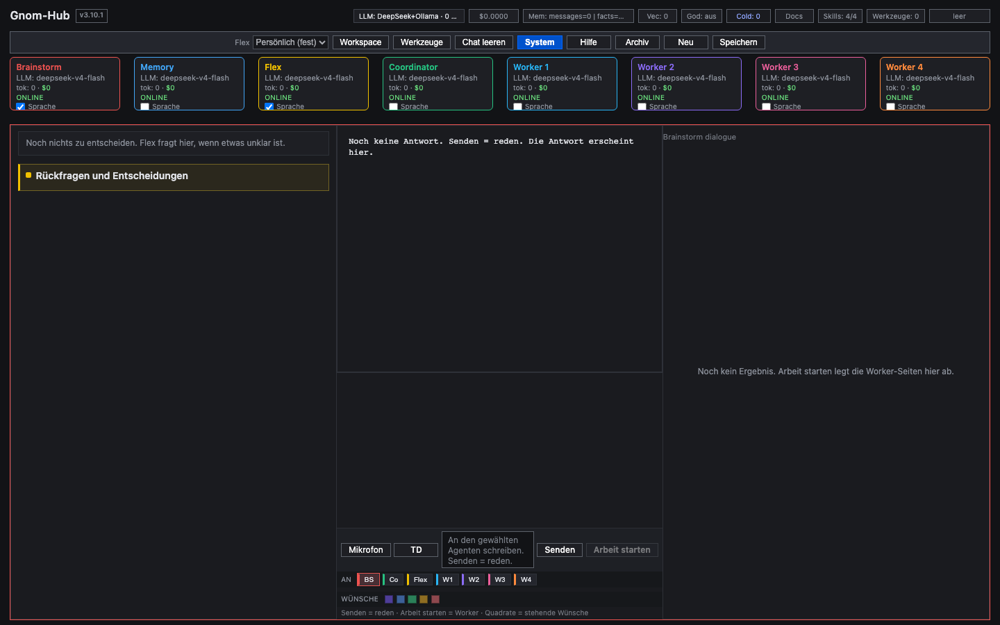
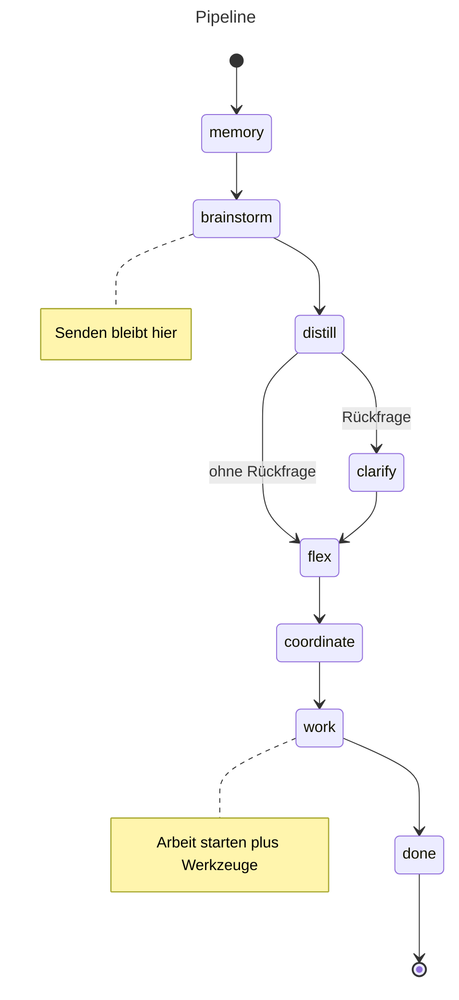

<p align="center"></p>
<p align="center"></p>

<p align="center"><strong>Ein lokaler Arbeitsplatz für die Zusammenarbeit mit KI-Agenten.</strong></p>

Senden heißt reden. Arbeit starten heißt Arbeiter. God nur über den roten Badge.

---

## 1 · Was ist Gnom-Hub-V1?

Gnom-Hub-V1 ist ein persönlicher Multi-Agenten-Desk auf deinem Rechner. Du siehst, wer spricht, wer plant und wer liefert.

Zwei Taten bleiben getrennt:

- **Senden** (Enter) — nur Gespräch. Keine Arbeiter, keine Werkzeuge, keine Dateiänderung.
- **Arbeit starten** (Ctrl/⌘+Enter) — Distill, dann Arbeiter. Ergebnisse in Box 3.

Es ist kein Autopilot und keine Cloud-Plattform. Es steuert deinen Mac nicht still bei jeder Nachricht.

Produktseite: [gnom-hub-v1.netzwerkpunkt.de](https://gnom-hub-v1.netzwerkpunkt.de/)

---

## 2 · Aktuelles Bild



Acht Agentenkarten oben. Drei Boxen darunter: links Fragen (Box 1), Mitte Antworten (Box 2), rechts Lieferung (Box 3). Unten die Zeile mit **Senden** und **Arbeit starten**.

---

## 3 · Download und Installation

Das ist eine **Terminal-Schnellinstallation**, kein Ein-Klick.

Voraussetzung: Git, Python 3.10+, macOS oder Linux. Kein Docker.

Ein Befehl (danach Key eintragen):

```bash
curl -fsSL https://raw.githubusercontent.com/landjunge/gnom-hub-v1/main/scripts/get.sh | sh
```

Schon geklont:

```bash
./scripts/install.sh
```

`install.sh` lässt ein vorhandenes `.venv` unangetastet. Persönliche Daten liegen in **WS-gnom-hub-v1** neben dem Repo, nicht im Git.

macOS Intel, Apple Silicon und Linux nutzen denselben Terminal-Weg. Ein Fremd-Mac-Test ohne Repo-Wissen ist noch nicht abgenommen.

Entwicklerinstallation bleibt `./scripts/install.sh` plus optional `.[dev]`.

---

## 4 · Erster Start

```bash
./scripts/start.sh
# → http://127.0.0.1:8080/
```

Key: `WS-gnom-hub-v1/User/Key.txt` (Vorlage `Key.txt.example`).

```text
DEEPSEEK_API_KEY=sk-...
DEEPSEEK_MODEL=deepseek-v4-flash
```

Platzhalter `sk-your-…` gelten nicht als bereit. Ohne echten Key (und ohne Ollama) sagen die Arbeiter **FEHLER**, sie täuschen keine Lieferung vor.

System zeigt, wenn der Key fehlt oder TollGate fehlt. TollGate braucht das Paket, sonst Cloud-Modelle nicht.

Nie `Key.txt`, `User/` oder `.env` committen. Details: [docs/KEYS_AND_MODELS.md](docs/KEYS_AND_MODELS.md).

---

## 5 · Senden, Arbeit starten und God-Mode

| Tat | Was passiert | Was nicht passiert |
|-----|----------------|--------------------|
| **Senden** / Enter | Ein Gesprächszug. Antwort in Box 2 beim gewählten Flag. | Keine Arbeiter, keine Werkzeuge, keine Dateien. |
| **Arbeit starten** / Ctrl/⌘+Enter | Distill → Flex → Plan → Arbeiter. Lieferung in Box 3. | Startet nicht durch Senden, Kartenklick oder Ja auf eine alte Frage. |
| **God** | Roter Nutzer-Badge oben rechts. An = echte Maus/Tastatur/Shell nach Nachfrage. | Kein Schalter im System-Fenster. Aus = Trockenlauf. |

Kartenklick öffnet Infos. Das Sendeziel bleibt das gelbe Flag.

Hilfe im Desk: Themen **Senden**, **Arbeit**, **God**.

---

## 6 · Agenten, Flags und Farben

Oben acht Karten. Das Flag wählt den Empfänger, nicht die Karte.

| Flag | Agent | Rolle |
|------|--------|--------|
| Brain | Brainstorm | Freies Gespräch |
| Mem | Memory | Session und Vorschläge |
| Flex | Flex | Stehende Wünsche, Rückfragen in Box 1 |
| Coord | Koordinator | Destilliert und plant Arbeiter |
| A1–A4 | Arbeiter 1–4 | Lieferung in Box 3 |

Kurze weiße Namen auf den Reitern. Voller Name im Hover.

---

## 7 · Dateien, Memory und Behalten

Box 3: Reiter A1–A4. **Sicht** = Seite, **Code** = Text. **Weg**, **Neu**, **Behalten** unter den Reitern.

**Behalten** meldet Erfolg erst, wenn die Datei wirklich geschrieben und zurückgelesen wurde.

Memory:

| Schicht | Wann |
|---------|------|
| HOT | Dieser Lauf. Entsteht von allein. |
| WARM | Erst nach **Behalten** in Box 1. |
| COLD | Archiv, nur bei Bedarf. |

ThreadDesk bekommt nur `handoff.json`. Gnom schreibt nicht in die ThreadDesk-Datenbank. `ran` bleibt immer false.

---

## 8 · Persönliche Daten

Repo = Code und Beispiele. **WS-gnom-hub-v1** = alles Persönliche, Erzeugte, Keys, Memory.

Push, Update und Neuinstallation dürfen diesen Ordner nicht überschreiben oder mitnehmen. Repo löschen gefährdet keine persönlichen Daten, wenn sie im Workspace liegen.

Workspace-Fenster: drei Spalten Temp, Dauerhaft, Behalten.

---

## 9 · Update und Wiederherstellung

Im Desk: **System**.

| Knopf | Bedeutung |
|-------|-----------|
| Suchen | GitHub nach einem Release fragen. Darf automatisch laufen. |
| Details | Installierte Version, Kanal, letzte Prüfung, Hinweis. |
| Aktualisieren | Nur nach Klick. Blockiert bei laufender Arbeit. Nie still von `main`. |
| Wiederherstellen | Vorhandenes Backup laden. Kein stilles Zurückspielen. |

Solange Daniel kein Nutzer-Release veröffentlicht hat, gibt es nichts zum Installieren. Backup vor jedem echten Wechsel.

Notfall: Backup in der System-Liste mit **Laden**.

---

## 10 · Typische Fehler

| Symptom | Was tun |
|---------|---------|
| Key fehlt | `WS-gnom-hub-v1/User/Key.txt` oder System. Platzhalter zählen nicht. |
| TollGate fehlt | `./scripts/install.sh` mit Sibling `../tollgate`, oder `GNOM_TOLLGATE_LLM=0`. |
| Arbeiter sagt FEHLER | Kein Key / kein Modell. Keine Attrappe. |
| Senden tut „nichts“ | Antwort steht in Box 2 beim Flag, nicht als Arbeiter-Seite. |
| Arbeit startet nicht | Nur **Arbeit starten** oder Ctrl/⌘+Enter. Offene Frage in Box 1 zuerst beantworten. |
| Update geht nicht | Laufende Arbeit abbrechen, oder es gibt noch kein Nutzer-Release. |
| God greift nicht | Nur der rote Badge. System-Fenster hat keinen God-Schalter. |
| Webhook antwortet 401 | Secret oder HMAC falsch. `GNOM_WEBHOOK_SECRET` muss dem GitHub-Webhook-Secret gleichen. |
| Webhook startet nicht | `GNOM_WEBHOOK_SECRET` in `.env` setzen. Port 8088 nutzen, nicht den Desk auf 8080. |

---

## 11 · Entwicklerbereich

```bash
ruff check . && ruff format --check .
pytest tests/ -q --tb=short
./scripts/prepush_gate.sh
```

UI: `src/gnom_hub/ui/static/parts/*.js` → `python scripts/build_ui_js.py` → `app.js` (nicht von Hand).  
CSS: `css/*.css` → `python scripts/build_ui_css.py` → `app.css`.



```
Senden           → nur Gespräch (Flex darf nach Arbeit starten fragen)
Arbeit starten   → Distill → Flex → Plan → Prefetch → Arbeiter → Nudge
```

API-URLs bleiben stabil. Coding-Regeln: [AGENTS.md](AGENTS.md). Index: [docs/INDEX.md](docs/INDEX.md).

### GitHub PR-Webhook

`scripts/github_pr_webhook.py` nimmt GitHub-Events entgegen. Nur bei **changes requested** startet er den Builder (`GNOM_BUILDER_CMD`). Der Desk auf Port 8080 bleibt getrennt — den Webhook mit `--port 8088` starten.

Abhängigkeiten: Python 3.10+, Standardbibliothek. Siehe `requirements.txt` (keine pip-Pakete).

#### Server starten

```bash
cp .env.example .env   # GNOM_WEBHOOK_SECRET und GNOM_BUILDER_CMD setzen
set -a && source .env && set +a
python3 scripts/github_pr_webhook.py --host 127.0.0.1 --port 8088
# → GET  http://127.0.0.1:8088/health
# → POST http://127.0.0.1:8088/webhook
```

Als Dienst statt nur manuell:

```bash
# Linux (Host-Builder, empfohlen)
# Pfade in der Unit anpassen, dann:
sudo cp deploy/gnom-pr-webhook.service /etc/systemd/system/
sudo systemctl daemon-reload
sudo systemctl enable --now gnom-pr-webhook.service

# Docker — nur dieser Listener, nicht der Desk
docker compose up -d
```

`GNOM_BUILDER_CMD` läuft dort, wo der Server läuft. Ein lokales Builder-CLI gehört deshalb an systemd oder den manuellen Start, nicht in den Container.

#### Tunnel (ngrok oder Cloudflare)

GitHub muss `https://…/webhook` erreichen. Der Prozess bleibt auf 127.0.0.1:8088.

ngrok:

```bash
ngrok http 8088
# Payload-URL: https://<subdomain>.ngrok-free.app/webhook
```

Cloudflare Tunnel:

```bash
cloudflared tunnel --url http://127.0.0.1:8088
# Payload-URL: https://<trycloudflare-host>/webhook
```

#### Webhook in GitHub registrieren

Repo → **Settings → Webhooks → Add webhook**:

| Feld | Wert |
|------|------|
| Payload URL | `https://<tunnel-host>/webhook` |
| Content type | `application/json` |
| Secret | derselbe Wert wie `GNOM_WEBHOOK_SECRET` |
| SSL verification | Enable |
| Events | **Let me select individual events** → Pull requests, Pull request reviews |

Speichern. GitHub schickt einen Ping; der Server antwortet 200 und ignoriert ihn (kein Builder).

#### Smoke-Test

Falsche Signatur muss 401 liefern, passende Signatur 200 (Event `opened` startet keinen Builder):

```bash
./scripts/webhook_smoke.sh
# oder gegen einen laufenden Dienst:
#   export GNOM_WEBHOOK_SECRET='…'   # gleicher Wert wie der Server
#   ./scripts/webhook_smoke.sh http://127.0.0.1:8088
```

Dasselbe per Hand (Secret in `$GNOM_WEBHOOK_SECRET`, Body ohne Extra-Newline):

```bash
BODY='{"action":"opened","number":1,"pull_request":{"number":1}}'
URL=http://127.0.0.1:8088/webhook

curl -sS -o /dev/stderr -w 'HTTP %{http_code}\n' -X POST "$URL" \
  -H 'Content-Type: application/json' \
  -H 'X-GitHub-Event: pull_request' \
  -H 'X-Hub-Signature-256: sha256=deadbeef' \
  --data-binary "$BODY"
# expect HTTP 401

SIG=$(printf '%s' "$BODY" | python3 -c 'import hashlib,hmac,os,sys
s=os.environ["GNOM_WEBHOOK_SECRET"].encode(); b=sys.stdin.buffer.read()
print("sha256="+hmac.new(s,b,hashlib.sha256).hexdigest())')
curl -sS -o /dev/stderr -w 'HTTP %{http_code}\n' -X POST "$URL" \
  -H 'Content-Type: application/json' \
  -H 'X-GitHub-Event: pull_request' \
  -H "X-Hub-Signature-256: $SIG" \
  --data-binary "$BODY"
# expect HTTP 200
```

| Dokument | Thema |
|----------|--------|
| [docs/KEYS_AND_MODELS.md](docs/KEYS_AND_MODELS.md) | Keys und Modelle |
| [docs/HUB_ARCHITECTURE.md](docs/HUB_ARCHITECTURE.md) | Schichten |
| [docs/TESTING.md](docs/TESTING.md) | Tests |
| [docs/TOOLS_PORTFOLIO.md](docs/TOOLS_PORTFOLIO.md) | Werkzeuge und Computer-Use |

---

## 12 · Reifegrad und bekannte Grenzen

Nutzbarer Desk auf diesem Mac. Kein unbeaufsichtigter Autopilot.

Bekannt und ehrlich:

- Installation ist Terminal, kein Ein-Klick.
- Fremd-Mac-Test ohne Repo-Wissen fehlt noch.
- Es gibt noch kein von Daniel freigegebenes GitHub-Release. System-Update installiert deshalb nichts von `main`.
- Linux und macOS Intel teilen den Terminal-Weg; eigene Installer-Pakete fehlen.
- Live-Provider braucht einen echten Key. Ohne Key keine vorgetäuschte Lieferung.
- God-Mode ist bewusst eng: nur der rote Badge, sonst Trockenlauf.

Kein Tag, kein GitHub-Release und keine Veröffentlichung ohne Daniels ausdrückliche Freigabe.

---

## Lizenz

Private Nutzung.
