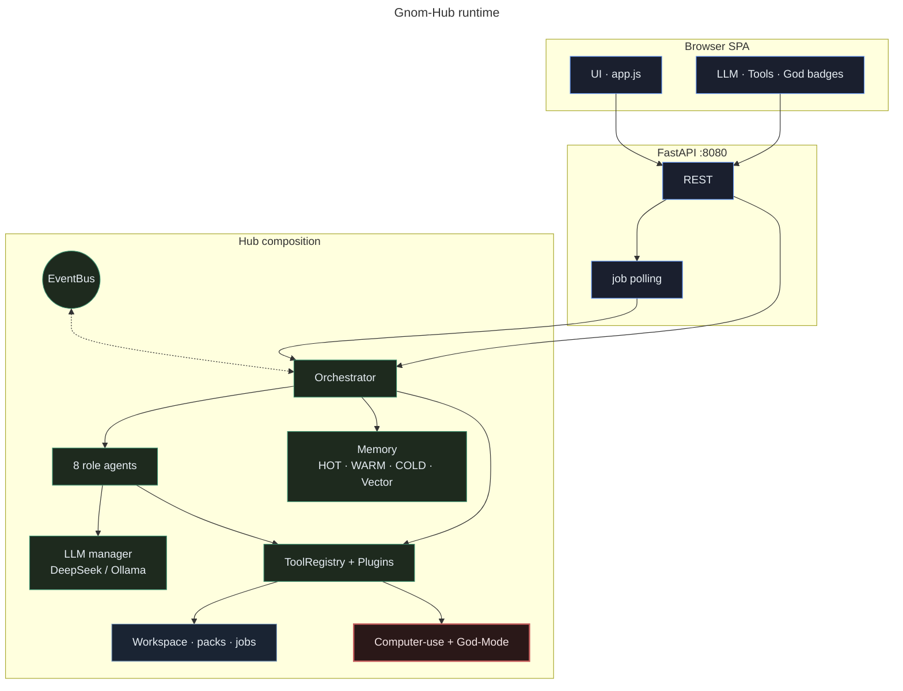
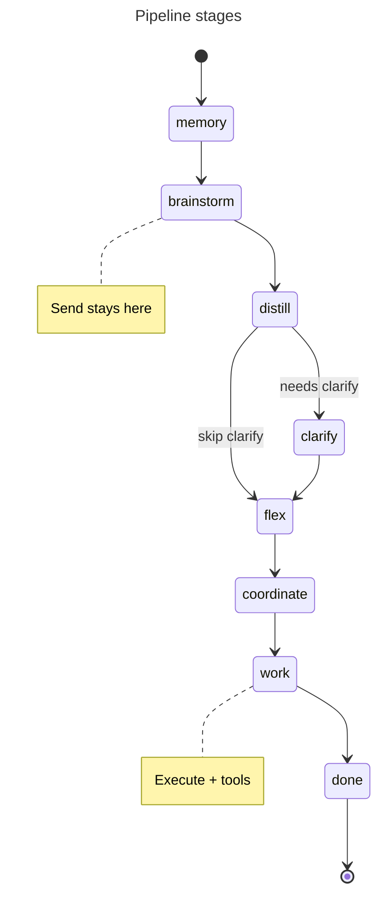
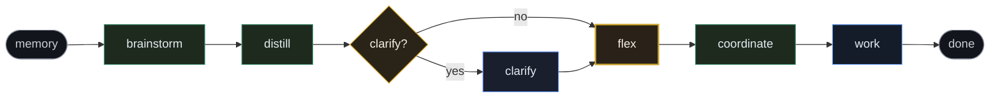
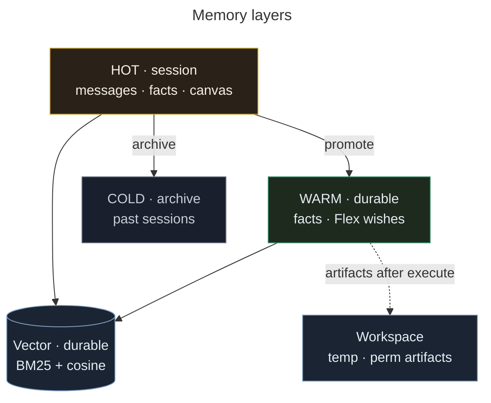

<p align="center"></p>
<p align="center"></p>

<p align="center"><strong>Ein lokaler Arbeitsplatz für die Zusammenarbeit mit KI-Agenten.</strong></p>

In Gnom-Hub-V1 kannst du Ideen entwickeln, Aufgaben vorbereiten und erst dann bewusst ausführen.

### 👤 [Für Nutzer – den Desk starten](#für-nutzer)

### 🛠️ [Für Entwickler – Aufbau und Erweiterungen](#für-entwickler)

---

## Für Nutzer

### Einfach erklärt

Beim Arbeiten mit KI ist ein Chat schnell abgeschickt. Ein echter Agent kann aber Dateien verändern, Werkzeuge starten und Geld kosten.

Gnom-Hub trennt deshalb zwei Dinge:

- **Send** bedeutet reden und nachdenken.
- **Execute** bedeutet wirklich ausführen.

Die wichtigste Regel lautet:

> **Brainstorm frei. Execute nur auf Absicht.**

### Was du davon hast

- Du siehst, welche Agenten an welcher Aufgabe arbeiten.
- Ideen können zuerst ohne Ausführung entwickelt werden.
- Worker starten erst nach deiner bewussten Entscheidung.
- Dateien, Werkzeuge, Kosten und Status bleiben sichtbar.
- Der Desk läuft lokal und benötigt kein Docker.

### In drei Schritten

1. **Installieren** – den lokalen Desk einrichten.
2. **Brainstormen** – eine Aufgabe im Chat besprechen.
3. **Ausführen** – erst bei einem brauchbaren Plan Execute drücken.

### Was Gnom-Hub-V1 nicht ist

Es ist kein unbeaufsichtigter Autopilot und keine Cloud-Plattform. Es soll nicht bei jeder Nachricht still deinen Computer steuern.

### Heutiger Stand – ehrlich

| Bereich | Aktueller Stand |
|---|---|
| Desk | Lokale Oberfläche mit Chat, Agentenkarten und Arbeitsboxen |
| Trennung | Send für Dialog; Execute für Worker und Werkzeuge |
| Modelle | DeepSeek; optional Ollama |
| Speicher | HOT, WARM, COLD und optionale Vektorsuche |
| Werkzeuge | Registry, Plugins und kontrollierte Computer-Nutzung |
| Reife | Nutzbarer Prototyp; vor wichtigen Aufgaben selbst prüfen |

[Produktseite](https://gnom-hub-v1.netzwerkpunkt.de/) · [Installation](#2--install)

---

## Für Entwickler

Gnom-Hub-V1 verbindet eine lokale Oberfläche, FastAPI, Agentenrollen, Speicher, Werkzeuge und Plugins. Die technische Dokumentation bleibt darunter vollständig erhalten.

## How this is built / Wie dieses Projekt entsteht

**System Designer & Product Architect** — Daniel Filipek (landjunge)

Ich arbeite anders: Ich entwickle Systeme und Produkte mit KI als technischem Partner.

Meine Stärke liegt darin, Probleme zu erkennen, Systeme in eigenständige Werkzeuge zu zerlegen und klare Grenzen und Schnittstellen zu definieren. Produktvision, Prioritäten und Architekturentscheidungen kommen von mir. KI ist der technische Partner für Implementierung, Tests und Dokumentation.

Ich bin kein klassischer Softwareentwickler und kein Security-Spezialist. Die technische Umsetzung entsteht gemeinsam mit KI und muss – besonders bei sicherheitskritischen Projekten – überprüfbar sein.

Was ich einbringe: Idee, Systemdenken, Anforderungen, gewünschtes Verhalten, klare Grenzen.  
Was überprüfbar sein muss: der Code, die Specs, die Tests. Reviews sind willkommen.

Open Source und öffentlich entwickelt. Kritik, Tests und Beiträge sind willkommen.

Gnom-Hub-V1: Brainstorm frei, Execute nur auf Absicht. Die Produktregel kommt von mir.

## Map

| Section | What you get |
|---------|----------------|
| [1 · Product](#1--product) | What it is / is not |
| [2 · Install](#2--install) | One-command setup + keys |
| [3 · Desk](#3--desk) | Chat, boxes, badges |
| [4 · Skills & memory](#4--skills--memory) | Playbooks, HOT/WARM/Vector |
| [5 · Tools & plugins](#5--tools--plugins) | Registry, computer-use |
| [6 · Architecture](#6--architecture) | Pipeline diagram |
| [7 · Develop](#7--develop) | Lint, tests, quality |
| [8 · Docs search](#8--docs-search) | Index automation + API |

---

## 1 · Product

### What it is

Product rule:

> **Brainstorm freely. Execute only when you press Execute.**

Exploration stays cheap and reversible. Workers (cost, files, side effects) start only on purpose.

| Strengths | |
|-----------|--|
| **Brainstorm → Execute** | Send = dialogue only; workers after **Execute** |
| **Visible desk** | 8 agent cards · 3 boxes · who works where |
| **One HTML file** | Landing tasks → one worker, one complete page |
| **Local & portable** | `User/Key.txt` · USB-friendly `data/` · **no Docker** · no cloud lock-in |
| **Honest auth** | Placeholders (`sk-your-…`) ≠ ready; workers say **FEHLER**, not fake stubs |
| **Safe computer-use** | Mouse/keyboard/shell dry-run until **God-Mode** |
| **Visible tools** | Registry · plugins · prefetch · **Tools** badge · light trace |
| **Flex** | Standing wishes as absolute orders · inject + nudge workers |
| **Playbook skills** | Markdown skills (inject) · learn from Execute · local catalog |
| **Vector search** | bow default · optional **fastembed** neural · Vector modal |
| **UI polish** | Coherent agent colors · adaptive job poll · mobile tabs |

**For:** desktop multi-agent control, HTML deliverables with preview, cost/key/cancel ops.  
**Not for:** Docker/K8s deploys, unattended full autonomy, LangGraph drop-in, silent PC control on every message.

### Screenshots


*Agent cards · work boxes · chat*


*Tools modal: core tools + computer-use*

---

## 2 · Install

### Quick start

One command (git + Python 3.10+, no Docker):

```bash
curl -fsSL https://raw.githubusercontent.com/landjunge/gnom-hub-v1/main/scripts/get.sh | sh
```

Then put a real key in `User/Key.txt` and start the desk:

```bash
cd ~/gnom-hub-v1
./scripts/start.sh
# → http://127.0.0.1:8080/
```

Already cloned:

```bash
./scripts/install.sh && ./scripts/start.sh
```

### Keys

1. Copy `Key.txt.example` → **`User/Key.txt`** (root `Key.txt` still works as legacy).
2. Set a **real** key (not `sk-your-…`):

```text
DEEPSEEK_API_KEY=sk-...          # system agents
WORKER_API_KEY=sk-...            # optional; falls back to system key
DEEPSEEK_MODEL=deepseek-v4-flash
```

Never commit `Key.txt`, `User/`, or `.env`. Details: [docs/KEYS_AND_MODELS.md](docs/KEYS_AND_MODELS.md).

Without a usable key (and without Ollama), workers report **FEHLER — kein Deliverable** instead of pretending success.

---

## 3 · Desk

### Using the desk

### Chat

| Control | Action |
|---------|--------|
| **Send** | One brainstorm turn → Box 2 |
| **TD** | Fill chat from last ThreadDesk packet (does not send) |
| **Execute** | Distill → Flex → plan → worker(s) → Box 3 + Memory |
| **Send+Exec** | Both in sequence |
| **Mic** | Browser speech-to-text |
| **Cancel** | Soft-cancel the running job |

Flag chips in chat attach intent colors where enabled.

### Boxes

| Box | Role |
|-----|------|
| **1 · Arounder** | Help · Clarify (Yes / No / Whatever / Later) |
| **2 · Brainstorm** | Multi-turn dialogue |
| **3 · Workers** | Deliverable — HTML Preview / Source / Copy |

### Header badges

| Badge | Meaning |
|-------|---------|
| **LLM** | Live / placeholder / blocked / no key |
| **Tools: N** | Tool calls this pipeline run |
| **God · Mem · Vec · Skills · Cold · Stage** | Ops status |

### Agents

| Agent | Role | Default |
|-------|------|---------|
| Brainstorm | Multi-turn partner | on |
| Memory | Recall + durable facts | on (locked) |
| Flex | Wishes → WARM · co-talk · Execute · worker nudge | on (**locked**) |
| Coordinator | Distill · plan workers | on |
| Worker 1–4 | Deliverables (3–4 toggleable) | on |

### Computer use

**Tools → Computer use** — Inspect · Click · Type · Shell.

| God-Mode | Behavior |
|----------|----------|
| **off** | Dry-run only (default) |
| **on** | Real mouse / keyboard / allowlisted shell |

```bash
pip install -e ".[computer]"   # optional
```

→ [docs/TOOLS_PORTFOLIO.md](docs/TOOLS_PORTFOLIO.md)

---

## 4 · Skills & memory

### Playbook skills (not a workflow engine)

Skills are **markdown playbooks** injected into agent prompts. They do **not** change pipeline stages.

| Action | How |
|--------|-----|
| List / toggle | Badge **Skills** → modal |
| Install folder | Skills modal path + Install (text-only packs) |
| Learn from last run | **Als Skill speichern** / `POST /api/skills/learn_from_last` |
| Seeds | `html_landing` · `tool_honesty` · `de_desk` · `qa_checklist` |

→ [docs/SKILLS.md](docs/SKILLS.md) · freeze: [WORKFLOWS_AND_PRESETS.md](docs/WORKFLOWS_AND_PRESETS.md)

### Memory tiers

| Tier | Role |
|------|------|
| **HOT** | Session / short context |
| **WARM** | Durable facts + Flex wishes |
| **COLD** | Archives |
| **Vector** | Searchable docs (embedder switchable) |

### Neural embeddings (optional)

```bash
./scripts/install_embeddings.sh
# or desk: Vector → Install neural → fastembed → Apply + reindex
```

Default without install: **bow**. Models vs vector DBs: [docs/VECTORS_AND_RUST.md](docs/VECTORS_AND_RUST.md).

---

## 5 · Tools & plugins

### Core tools

| Tool | Purpose |
|------|---------|
| `hub_status` | Stage · auth · tool_calls · god |
| `tools_list` | Catalog (`tag` filter optional) |
| `memory_search` | Vector / lexical search |
| `pipeline_do` | Full pipeline from task text |
| `pipeline_info` | Stage · tool_calls · quality head |
| `web_fetch` | Public HTTP(S) → text (SSRF-safe defaults) |
| `workspace_list` / `workspace_read` | Hub workspace zones |
| `trace_tail` | Last light-trace events |

API: `GET /api/plugins` · `POST /api/tools/call` · `GET /api/mcp/tools`

### Worker prefetch (on Execute)

| When | Tool |
|------|------|
| URLs in task | `web_fetch` |
| Standing context | `memory_search` |
| Missing allowlisted deps | `install_tool` (dry-run first) |

Calls appear as `pipeline.tool_call` and in the **Tools** badge.

### Plugins

Trusted packs: `plugins/<id>/plugin.json` + `main.py`.

```bash
python scripts/new_plugin.py my_tool
# edit plugins/my_tool/ · restart or:
# POST /api/plugins/reload?plugin_id=my_tool
```

```python
from gnom_hub.plugins.sdk import ok, fail, retry

def run(text: str = "") -> dict:
    if not text.strip():
        return fail("text required")
    return ok(result=text)
```

Bundled includes: `echo`, `install_tool`, `text_stats`, `embeddings_lite`, `embeddings_neural`, browser/file/git/shell packs · template: `plugins/_template/` (not loaded).  
→ [docs/PLUGINS.md](docs/PLUGINS.md) · [PLUGIN_SECURITY.md](docs/PLUGIN_SECURITY.md)

---

## 6 · Architecture

### System overview



Classes: [docs/MERMAID.md](docs/MERMAID.md) (`ui` · `core` · `warm` · `store` · `danger`).

### Pipeline





```
Send     → brainstorm only (+ Flex wishes / optional auto-Execute)
Execute  → distill → flex inject → plan → prefetch tools → workers → nudge
Telegram → one-shot /do
```

Deep sequences (Send · Execute · Tools): [docs/ARCHITECTURE.md · [HUB_ARCHITECTURE.md](docs/HUB_ARCHITECTURE.md)](docs/ARCHITECTURE.md#paths-over-time-sequence).
| Path | Behavior |
|------|----------|
| **Send** | Dialogue only; Flex may absorb wishes / auto-Execute when clear |
| **Execute** | Distill · wish inject · plan · prefetch · workers · gates · Flex nudge |
| **Telegram / tests** | One-shot `/do` path |

### Memory



| Layer | Lifetime | Purpose |
|-------|----------|---------|
| **HOT** | Session | Messages · session facts · canvas |
| **WARM** | Durable | Standing facts / Flex wishes |
| **COLD** | Archive | Saved sessions |
| **Vector** | Durable | Hybrid BM25 + cosine |
| **Workspace** | Artifacts | Temp / permanent after execute |

Clean / Reset: HOT + temp workspace + pipeline; **WARM stays** unless cleared explicitly.

### Plan modes (presets)

| Mode | Behavior |
|------|----------|
| `default` | Auto full-page HTML when task looks like a page |
| `full_page_html` | Exactly one worker · one complete HTML page |
| `plan_qa` / `diagnosis` | Deterministic task templates |

→ [docs/WORKFLOWS_AND_PRESETS.md](docs/WORKFLOWS_AND_PRESETS.md)

---

## 7 · Develop

```bash
ruff check . && ruff format --check .
pytest tests/ -q --tb=short

./scripts/prepush_gate.sh
./scripts/install_git_hooks.sh   # pre-commit + pre-push + safe.directory

python scripts/mutation_check.py
./scripts/quality_check.sh
python scripts/basic_tests.py          # server on :8080
python scripts/user_scenarios_e2e.py   # Playwright
python -m gnom_hub.main --smoke
```

Coding agents: [AGENTS.md](AGENTS.md) — ruff + pytest green before every push; no secrets.  
Flex contract: [docs/AGENTS_DEFINITION.md](docs/AGENTS_DEFINITION.md) · Tests: [docs/TESTING.md](docs/TESTING.md)

---

## 8 · Docs search

### Index automation

```bash
python scripts/build_docs_index.py           # regenerate INDEX + catalog
python scripts/build_docs_index.py --check  # CI drift gate
python scripts/build_docs_index.py --search "skills embeddings"
```

Desk: badge **Docs** → type query → local hits (no cloud search engine).

API: `GET /api/docs` · `GET /api/docs/search?q=skills&limit=12`

### Documentation

**Full searchable index:** [docs/INDEX.md](docs/INDEX.md) (keyword map + A–Z).

| Document | Topic |
|----------|--------|
| [README_DE.md](README_DE.md) | German README |
| [docs/INDEX.md](docs/INDEX.md) | **All docs · keywords · A–Z** |
| [docs/INSTALL_SIMPLE.md](docs/INSTALL_SIMPLE.md) | One-command install · embeddings |
| [docs/HUB_ARCHITECTURE.md](docs/HUB_ARCHITECTURE.md) | Exact desk layers |
| [docs/ORCHESTRATION.md](docs/ORCHESTRATION.md) | Pipeline · agents · skills inject |
| [docs/SKILLS.md](docs/SKILLS.md) | Playbook skills API & authoring |
| [docs/PLUGINS.md](docs/PLUGINS.md) | Plugin catalog · neural embeddings |
| [docs/UI_QUALITY.md](docs/UI_QUALITY.md) | Colors · poll · a11y |
| [docs/STABILITY.md](docs/STABILITY.md) | Stability / quality gates |
| [docs/VECTORS_AND_RUST.md](docs/VECTORS_AND_RUST.md) | Embedders vs DBs · Tauri deferred |
| [AGENTS.md](AGENTS.md) | Coding rules · push gate |
| [docs/ARCHITECTURE.md](docs/ARCHITECTURE.md) | System map |
| [docs/CODE_ANALYSIS_FOR_AI.md](docs/CODE_ANALYSIS_FOR_AI.md) | Full AI handoff |
| [docs/KEYS_AND_MODELS.md](docs/KEYS_AND_MODELS.md) | Keys & models |
| [docs/PLUGIN_SECURITY.md](docs/PLUGIN_SECURITY.md) | Plugin trust |
| [docs/ERROR_HANDLING.md](docs/ERROR_HANDLING.md) | Errors · retries |
| [docs/MCP_ARCHITECTURE.md](docs/MCP_ARCHITECTURE.md) | MCP-lite |
| [docs/TOOLS_PORTFOLIO.md](docs/TOOLS_PORTFOLIO.md) | Computer-use |
| [docs/AGENTS_DEFINITION.md](docs/AGENTS_DEFINITION.md) | Agent roster · Flex |
| [docs/WORKFLOWS_AND_PRESETS.md](docs/WORKFLOWS_AND_PRESETS.md) | Presets · plan_mode freeze |
| [docs/TESTING.md](docs/TESTING.md) · [MUTMUT.md](docs/MUTMUT.md) | pytest · mutation |
| [docs/CHANGELOG_3.10.md](docs/CHANGELOG_3.10.md) · [GITHUB_HOLDER_3.10.md](docs/GITHUB_HOLDER_3.10.md) | 3.10 notes |
| [docs/V1_SCOPE.md](docs/V1_SCOPE.md) · [ROADMAP.md](docs/ROADMAP.md) · [V4_PLAN.md](docs/V4_PLAN.md) | Scope · roadmap |
| [docs/MERGE_STATUS.md](docs/MERGE_STATUS.md) | PR merge status |

---

## License

Private use.
