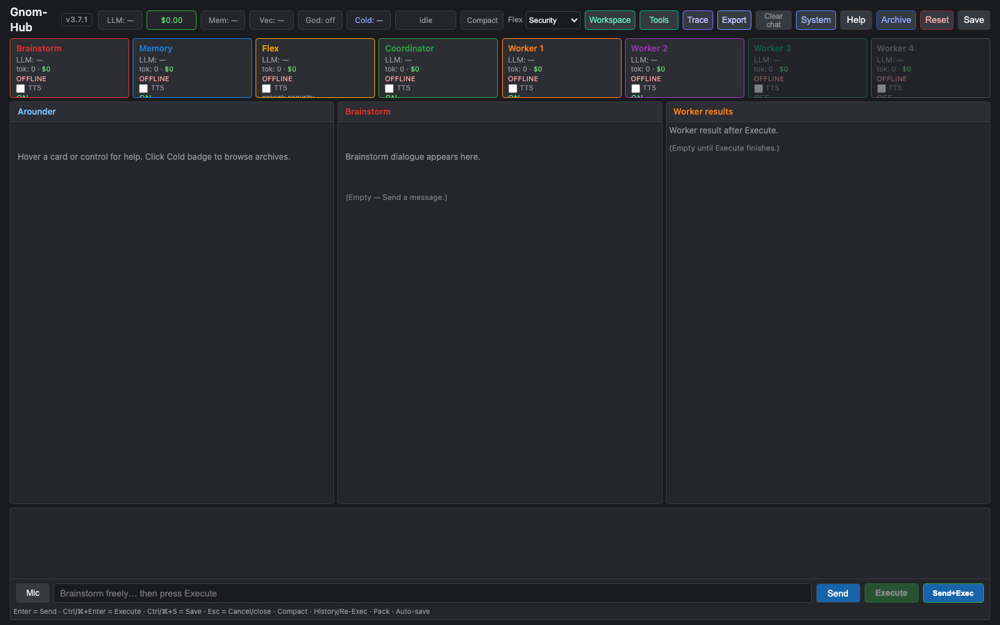
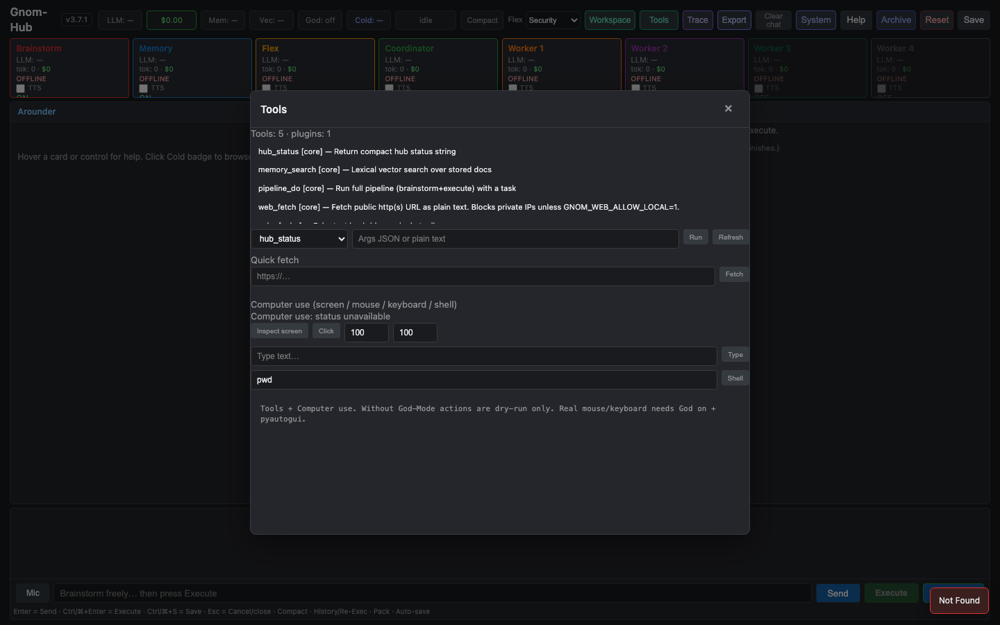

# Gnom-Hub

**Local multi-agent control hub** — brainstorm first, execute only when you say so.

| | |
|--|--|
| **Version** | 3.7.1 |
| **Stack** | Python ≥3.10 · FastAPI · desktop SPA |
| **UI** | `http://127.0.0.1:8080/` |
| **LLM** | DeepSeek (`deepseek-v4-flash`, thinking off) · optional Ollama |
| **License** | Private use |

**Deutsch:** [README_DE.md](README_DE.md)  
**Deep code handoff (for other AIs):** [docs/CODE_ANALYSIS_FOR_AI.md](docs/CODE_ANALYSIS_FOR_AI.md)

---

### Screenshots



*Eight agent cards · three work boxes · chat — local desktop*



*Tools modal: core tools + computer-use (Inspect / Click / Type / Shell)*

---

## Why Gnom?

Most agent products either **fire tools on every message** or hide control inside heavy frameworks. Gnom is built around one product rule:

> **Brainstorm freely. Execute only when you press Execute.**

That split is the product: exploration stays cheap and reversible; workers (cost, files, side effects) start only on purpose.

### What is strong

| Strength | In practice |
|----------|-------------|
| **Brainstorm → Execute** | Send is dialogue only. Workers run after **Execute** (or Send+Exec). |
| **Visible multi-agent desk** | Eight fixed roles as cards + three boxes — you see who is active and where output lands. |
| **One HTML page, not four** | Landing/page tasks assign **one worker** and **one complete** single-file HTML document. |
| **Local & portable** | Runs on your machine; keys in `Key.txt`; USB-friendly `data/`; no cloud lock-in required. |
| **Safety by default** | Mouse / keyboard / shell are **dry-run** until **God-Mode** is explicitly on. |
| **Operator ops** | HOT / WARM / COLD memory, workspace, backups, session packs, jobs, soft-cancel, light trace, budget guard. |
| **Lean orchestration** | One fixed pipeline. Team/worker **presets** + `plan_mode` only — no second workflow engine. |
| **Memory hygiene** | Durable facts go to WARM; HTML, meta, and pipeline junk are filtered out of storage. |

### Who it is for

- Builders who want a **desktop control surface** for multi-agent work  
- People who need **HTML deliverables** with in-box preview  
- Operators who care about **cost, keys, cancel, and audit** — not only vibe chat  

### Who it is not for

- Fully autonomous unattended agents with no human gate  
- Drop-in replacement for LangGraph / CrewAI research stacks  
- Silent PC control from every chat message  

---

## Quick start

```bash
cd gnom-hub-v1
./scripts/install.sh && source .venv/bin/activate
# Keys → Key.txt  (see docs/KEYS_AND_MODELS.md)
./scripts/start.sh
# open http://127.0.0.1:8080/
```

Copy `Key.txt.example` → `Key.txt` and set at least:

- `DEEPSEEK_API_KEY` — system agents (brainstorm, memory, flex, coordinator)  
- `WORKER_API_KEY` — workers (can be the same key)  
- `DEEPSEEK_MODEL=deepseek-v4-flash`  

Never commit `Key.txt` or `.env`.

Without API keys, the pipeline still runs with **stubs** (for tests / smoke).

---

## Using the desk

### Chat controls

| Control | Action |
|---------|--------|
| **Send** | One brainstorm turn → Box 2 |
| **Execute** | Distill → Flex → Coordinator plan → Worker(s) → Box 3 + Memory |
| **Send+Exec** | Both in sequence |
| **Mic** | Browser speech-to-text |
| **Cancel** | Soft-cancel the running job |

### Boxes

| Box | Role |
|-----|------|
| **1 · Arounder** | Help / tooltips · Clarify (Yes / No / Whatever / Later) |
| **2 · Brainstorm** | Multi-turn dialogue |
| **3 · Workers** | Deliverable — HTML **Preview** / Source / Copy |

### Agents (fixed roster)

| Agent | Role | Default |
|-------|------|---------|
| Brainstorm | Free multi-turn partner | on |
| Memory | Always-on recall + durable fact store | on (locked) |
| Flex | Security / neutral / researcher review | on |
| Coordinator | Distill requirements · plan worker tasks | on |
| Worker 1–2 | Produce deliverables | on |
| Worker 3–4 | Extra capacity | **off** |

### Computer use

**Tools → Computer use** — Inspect · Click · Type · Shell.

| Mode | Behavior |
|------|----------|
| God **off** | Dry-run only (safe default) |
| God **on** | Real mouse / keyboard / allowlisted shell |

```bash
pip install -e ".[computer]"   # optional extras
```

Details: [docs/TOOLS_PORTFOLIO.md](docs/TOOLS_PORTFOLIO.md).

---

## Architecture

```
Browser SPA (app.js)
       │  REST + job polling
       ▼
FastAPI  ──►  Hub (composition root)
                 ├── EventBus (sync)
                 ├── Orchestrator (stages)
                 ├── 8 role agents
                 ├── LLM manager (DeepSeek / Ollama)
                 ├── Memory (HOT / WARM / COLD / vector)
                 ├── Workspace
                 └── Computer-use kit (+ God-Mode)
```

### Pipeline stages

```
memory → brainstorm → distill → [clarify] → flex → coordinate → work → done
```

- **Brainstorm** (Send): dialogue only; no workers.  
- **Execute**: real pipeline; optional clarify in Box 1.  
- Full one-shot path exists for tests / Telegram (`/do`).  

### Memory layers

| Layer | Lifetime | Purpose |
|-------|----------|---------|
| **HOT** | Session | Messages, session facts, Mermaid canvas |
| **WARM** | Durable | Long-lived facts (survive HOT clear / clean) |
| **COLD** | Archive | Saved past sessions |
| **Vector** | Durable | Light lexical recall (bag-of-words cosine) |
| **Workspace** | Artifacts | Temp / permanent files after execute |

Clean / Reset clears HOT + temp workspace + pipeline; **WARM stays** unless cleared explicitly.

### Plan modes (presets)

Configured via team presets — not a second orchestrator:

| Mode | Behavior |
|------|----------|
| `default` | Coordinator plans tasks for enabled workers |
| `full_page_html` | Exactly **one** worker builds one complete HTML page |
| `plan_qa` | Deterministic QA-style task templates |
| `diagnosis` | Deterministic diagnosis templates |

See [docs/WORKFLOWS_AND_PRESETS.md](docs/WORKFLOWS_AND_PRESETS.md).

---

## Quality & contribution

```bash
ruff check .
ruff format .
ruff format --check .
pytest tests/ -q --tb=short

./scripts/quality_check.sh
python scripts/basic_tests.py          # needs server on :8080
python scripts/user_landing_e2e.py     # Playwright + live key
python -m gnom_hub.main --smoke        # brainstorm → execute without UI
```

Coding agents: follow [AGENTS.md](AGENTS.md) — ruff + pytest green before every push; commit and push after each completed step; never commit secrets.

---

## Documentation

| Document | Purpose |
|----------|---------|
| [README_DE.md](README_DE.md) | German README |
| [AGENTS.md](AGENTS.md) | Coding rules / push gate |
| [docs/CODE_ANALYSIS_FOR_AI.md](docs/CODE_ANALYSIS_FOR_AI.md) | Full architecture for external AIs |
| [docs/KEYS_AND_MODELS.md](docs/KEYS_AND_MODELS.md) | Keys & model IDs |
| [docs/BASIC_USER_TEST.md](docs/BASIC_USER_TEST.md) | Canonical user E2E |
| [docs/STABILITY.md](docs/STABILITY.md) | Stability checklist |
| [docs/TOOLS_PORTFOLIO.md](docs/TOOLS_PORTFOLIO.md) | Computer-use libraries |
| [docs/WORKFLOWS_AND_PRESETS.md](docs/WORKFLOWS_AND_PRESETS.md) | Presets & plan_mode |
| [docs/V1_SCOPE.md](docs/V1_SCOPE.md) | Product scope |
| [docs/ROADMAP.md](docs/ROADMAP.md) | Release history |

---

## License

Private use.
