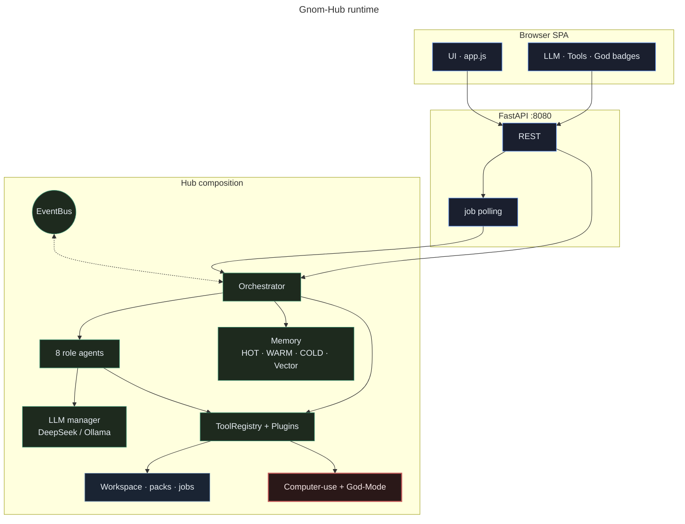
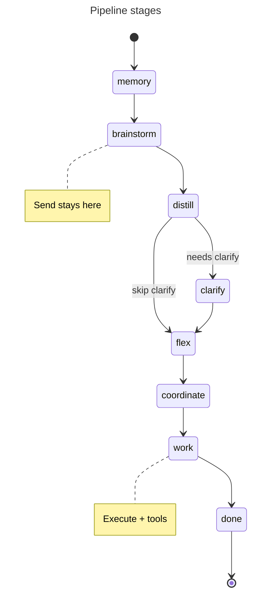
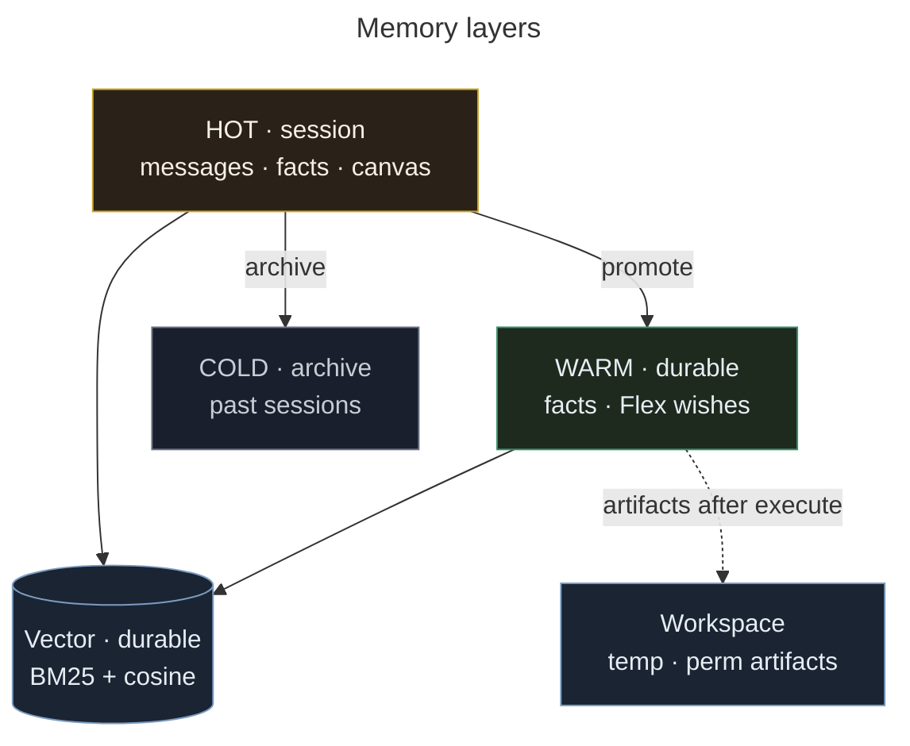

# Gnom-Hub

**Local multi-agent control hub** — brainstorm freely, execute only when you say so.

| | |
|--|--|
| **Version** | 3.9.1 ([notes](docs/CHANGELOG_3.9.md)) |
| **Docs** | [Hub arch](docs/HUB_ARCHITECTURE.md) · [Plugins](docs/PLUGINS.md) · [Merges](docs/MERGE_STATUS.md) |
| **Stack** | Python ≥3.10 · FastAPI · desktop SPA |
| **UI** | `http://127.0.0.1:8080/` |
| **LLM** | DeepSeek (`deepseek-v4-flash`) · optional Ollama |
| **License** | Private use |

**Deutsch:** [README_DE.md](README_DE.md) · **AI handoff:** [docs/CODE_ANALYSIS_FOR_AI.md](docs/CODE_ANALYSIS_FOR_AI.md)

---

## Contents

1. [What it is](#what-it-is)
2. [Quick start](#quick-start)
3. [Using the desk](#using-the-desk)
4. [Tools & plugins](#tools--plugins)
5. [How it works](#how-it-works)
6. [Develop & quality](#develop--quality)
7. [Documentation](#documentation)

---

## What it is

Product rule:

> **Brainstorm freely. Execute only when you press Execute.**

Exploration stays cheap and reversible. Workers (cost, files, side effects) start only on purpose.

| Strengths | |
|-----------|--|
| **Brainstorm → Execute** | Send = dialogue only; workers after **Execute** |
| **Visible desk** | 8 agent cards · 3 boxes · who works where |
| **One HTML file** | Landing tasks → one worker, one complete page |
| **Local & portable** | `User/Key.txt` · USB-friendly `data/` · **no Docker** · no cloud lock-in |
| **Honest auth** | Placeholders (`sk-your-…`) ≠ ready; workers say **FEHLER**, not fake stubs |
| **Safe computer-use** | Mouse/keyboard/shell dry-run until **God-Mode** |
| **Visible tools** | Registry · plugins · prefetch · **Tools** badge · light trace |
| **Flex** | Standing wishes as absolute orders · inject + nudge workers |

**For:** desktop multi-agent control, HTML deliverables with preview, cost/key/cancel ops.  
**Not for:** Docker/K8s deploys, unattended full autonomy, LangGraph drop-in, silent PC control on every message.

### Screenshots


*Agent cards · work boxes · chat*


*Tools modal: core tools + computer-use*

---

## Quick start

```bash
# No Docker — venv + local FastAPI only
cd gnom-hub-v1
./scripts/install.sh && source .venv/bin/activate
./scripts/start.sh
# → http://127.0.0.1:8080/
```

### Keys

1. Copy `Key.txt.example` → **`User/Key.txt`** (root `Key.txt` still works as legacy).
2. Set a **real** key (not `sk-your-…`):

```text
DEEPSEEK_API_KEY=sk-...          # system agents
WORKER_API_KEY=sk-...            # optional; falls back to system key
DEEPSEEK_MODEL=deepseek-v4-flash
```

Never commit `Key.txt`, `User/`, or `.env`. Details: [docs/KEYS_AND_MODELS.md](docs/KEYS_AND_MODELS.md).

Without a usable key (and without Ollama), workers report **FEHLER — kein Deliverable** instead of pretending success.

---

## Using the desk

### Chat

| Control | Action |
|---------|--------|
| **Send** | One brainstorm turn → Box 2 |
| **Execute** | Distill → Flex → plan → worker(s) → Box 3 + Memory |
| **Send+Exec** | Both in sequence |
| **Mic** | Browser speech-to-text |
| **Cancel** | Soft-cancel the running job |

Flag chips in chat attach intent colors where enabled.

### Boxes

| Box | Role |
|-----|------|
| **1 · Arounder** | Help · Clarify (Yes / No / Whatever / Later) |
| **2 · Brainstorm** | Multi-turn dialogue |
| **3 · Workers** | Deliverable — HTML Preview / Source / Copy |

### Header badges

| Badge | Meaning |
|-------|---------|
| **LLM** | Live / placeholder / blocked / no key |
| **Tools: N** | Tool calls this pipeline run |
| **God · Mem · Vec · Cold · Stage** | Ops status |

### Agents

| Agent | Role | Default |
|-------|------|---------|
| Brainstorm | Multi-turn partner | on |
| Memory | Recall + durable facts | on (locked) |
| Flex | Wishes → WARM · co-talk · Execute · worker nudge | on (**locked**) |
| Coordinator | Distill · plan workers | on |
| Worker 1–4 | Deliverables (3–4 toggleable) | on |

### Computer use

**Tools → Computer use** — Inspect · Click · Type · Shell.

| God-Mode | Behavior |
|----------|----------|
| **off** | Dry-run only (default) |
| **on** | Real mouse / keyboard / allowlisted shell |

```bash
pip install -e ".[computer]"   # optional
```

→ [docs/TOOLS_PORTFOLIO.md](docs/TOOLS_PORTFOLIO.md)

---

## Tools & plugins

### Core tools

| Tool | Purpose |
|------|---------|
| `hub_status` | Stage · auth · tool_calls · god |
| `tools_list` | Catalog (`tag` filter optional) |
| `memory_search` | Vector / lexical search |
| `pipeline_do` | Full pipeline from task text |
| `pipeline_info` | Stage · tool_calls · quality head |
| `web_fetch` | Public HTTP(S) → text (SSRF-safe defaults) |
| `workspace_list` / `workspace_read` | Hub workspace zones |
| `trace_tail` | Last light-trace events |

API: `GET /api/plugins` · `POST /api/tools/call` · `GET /api/mcp/tools`

### Worker prefetch (on Execute)

| When | Tool |
|------|------|
| URLs in task | `web_fetch` |
| Standing context | `memory_search` |
| Missing allowlisted deps | `install_tool` (dry-run first) |

Calls appear as `pipeline.tool_call` and in the **Tools** badge.

### Plugins

Trusted packs: `plugins/<id>/plugin.json` + `main.py`.

```bash
python scripts/new_plugin.py my_tool
# edit plugins/my_tool/ · restart or:
# POST /api/plugins/reload?plugin_id=my_tool
```

```python
from gnom_hub.plugins.sdk import ok, fail, retry

def run(text: str = "") -> dict:
    if not text.strip():
        return fail("text required")
    return ok(result=text)
```

Bundled: `echo`, `install_tool`, `text_stats` · template: `plugins/_template/` (not loaded).  
→ [docs/PLUGIN_SECURITY.md](docs/PLUGIN_SECURITY.md)

---

## How it works

### System overview



Classes: [docs/MERMAID.md](docs/MERMAID.md) (`ui` · `core` · `warm` · `store` · `danger`).

### Pipeline




```
Send     → brainstorm only (+ Flex wishes / optional auto-Execute)
Execute  → distill → flex inject → plan → prefetch tools → workers → nudge
Telegram → one-shot /do
```

Deep sequences (Send · Execute · Tools): [docs/ARCHITECTURE.md · [HUB_ARCHITECTURE.md](docs/HUB_ARCHITECTURE.md)](docs/ARCHITECTURE.md#paths-over-time-sequence).
| Path | Behavior |
|------|----------|
| **Send** | Dialogue only; Flex may absorb wishes / auto-Execute when clear |
| **Execute** | Distill · wish inject · plan · prefetch · workers · gates · Flex nudge |
| **Telegram / tests** | One-shot `/do` path |

### Memory



| Layer | Lifetime | Purpose |
|-------|----------|---------|
| **HOT** | Session | Messages · session facts · canvas |
| **WARM** | Durable | Standing facts / Flex wishes |
| **COLD** | Archive | Saved sessions |
| **Vector** | Durable | Hybrid BM25 + cosine |
| **Workspace** | Artifacts | Temp / permanent after execute |

Clean / Reset: HOT + temp workspace + pipeline; **WARM stays** unless cleared explicitly.

### Plan modes (presets)

| Mode | Behavior |
|------|----------|
| `default` | Auto full-page HTML when task looks like a page |
| `full_page_html` | Exactly one worker · one complete HTML page |
| `plan_qa` / `diagnosis` | Deterministic task templates |

→ [docs/WORKFLOWS_AND_PRESETS.md](docs/WORKFLOWS_AND_PRESETS.md)

---

## Develop & quality

```bash
ruff check . && ruff format --check .
pytest tests/ -q --tb=short

./scripts/prepush_gate.sh
./scripts/install_git_hooks.sh   # pre-commit + pre-push + safe.directory

python scripts/mutation_check.py
./scripts/quality_check.sh
python scripts/basic_tests.py          # server on :8080
python scripts/user_scenarios_e2e.py   # Playwright
python -m gnom_hub.main --smoke
```

Coding agents: [AGENTS.md](AGENTS.md) — ruff + pytest green before every push; no secrets.  
Flex contract: [docs/AGENTS_DEFINITION.md](docs/AGENTS_DEFINITION.md) · Tests: [docs/TESTING.md](docs/TESTING.md)

---

## Documentation

| Document | Topic |
|----------|--------|
| [README_DE.md](README_DE.md) | German README |
| [AGENTS.md](AGENTS.md) | Coding rules · push gate |
| [docs/ARCHITECTURE.md](docs/ARCHITECTURE.md) | System map |
| [docs/MERMAID.md](docs/MERMAID.md) | Mermaid syntax reference · class palette |
| [docs/CODE_ANALYSIS_FOR_AI.md](docs/CODE_ANALYSIS_FOR_AI.md) | Full AI handoff |
| [docs/KEYS_AND_MODELS.md](docs/KEYS_AND_MODELS.md) | Keys & models |
| [docs/PLUGIN_SECURITY.md](docs/PLUGIN_SECURITY.md) | Plugin trust & authoring |
| [docs/ERROR_HANDLING.md](docs/ERROR_HANDLING.md) | Error layers · envelopes · retries |
| [docs/MCP_ARCHITECTURE.md](docs/MCP_ARCHITECTURE.md) | MCP-lite server architecture |
| [docs/TOOLS_PORTFOLIO.md](docs/TOOLS_PORTFOLIO.md) | Computer-use libraries |
| [docs/AGENTS_DEFINITION.md](docs/AGENTS_DEFINITION.md) | Agent roster · Flex |
| [docs/WORKFLOWS_AND_PRESETS.md](docs/WORKFLOWS_AND_PRESETS.md) | Presets · plan_mode |
| [docs/BASIC_USER_TEST.md](docs/BASIC_USER_TEST.md) | User E2E |
| [docs/STABILITY.md](docs/STABILITY.md) | Stability checklist |
| [docs/TESTING.md](docs/TESTING.md) / [MUTMUT.md](docs/MUTMUT.md) | pytest · mutation |
| [docs/PYTHON_CACHE.md](docs/PYTHON_CACHE.md) | pip/venv CI cache strategies |
| [docs/V1_SCOPE.md](docs/V1_SCOPE.md) / [ROADMAP.md](docs/ROADMAP.md) | Scope · history |

---

## License

Private use.
