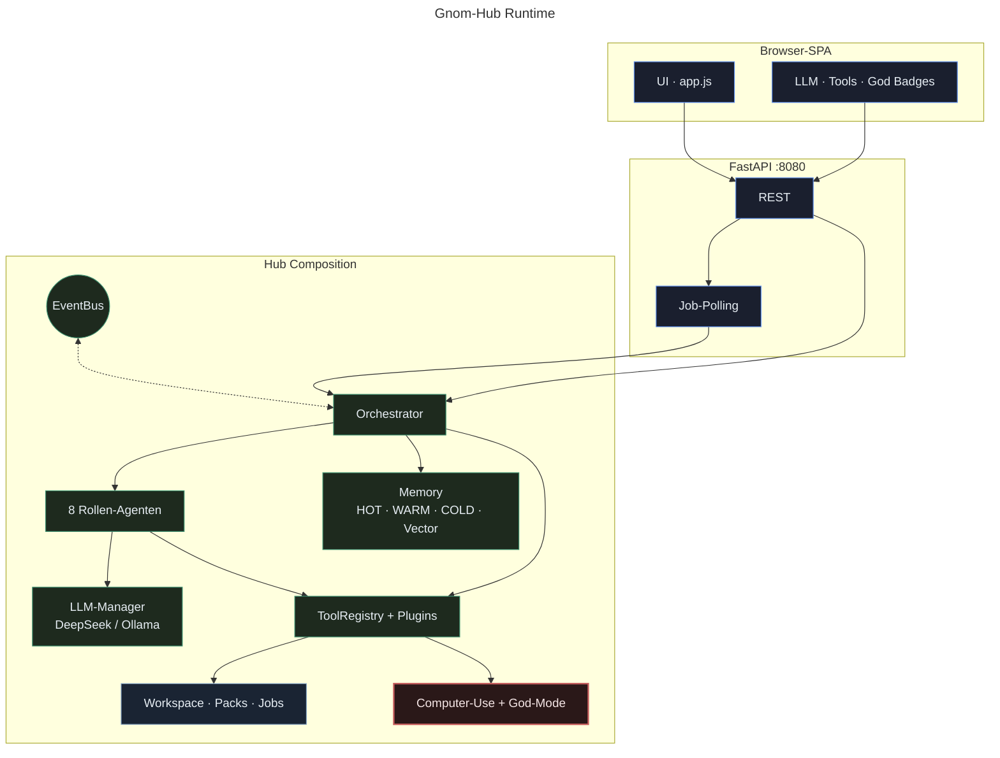
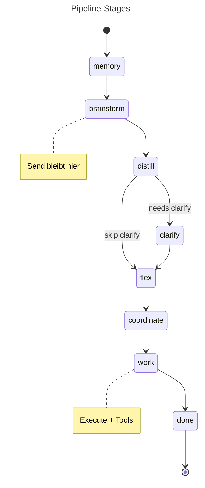
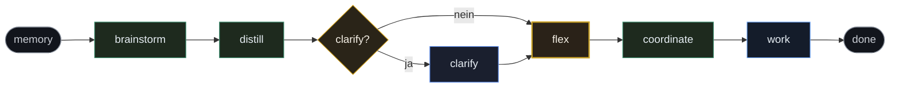
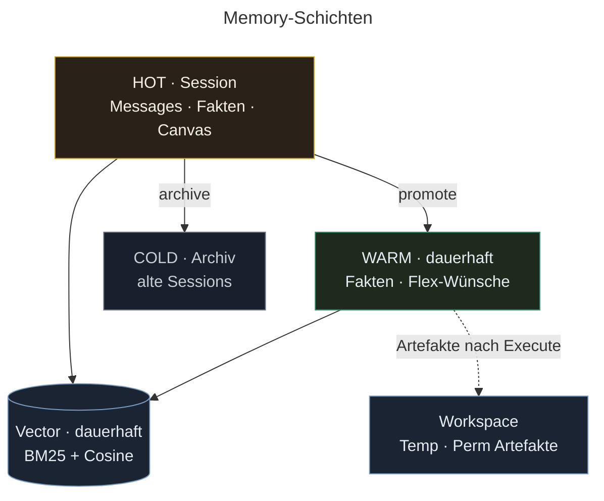

# Gnom-Hub

**Lokaler Multi-Agenten-Steuerungs-Hub** — frei brainstormen, ausführen nur wenn du es sagst.

| | |
|--|--|
| **Version** | 3.10.1 ([notes](docs/CHANGELOG_3.9.md)) |
| **Docs** | [Hub-Architektur](docs/HUB_ARCHITECTURE.md) · [Plugins](docs/PLUGINS.md) · [Merges](docs/MERGE_STATUS.md) |
| **Stack** | Python ≥3.10 · FastAPI · Desktop-SPA |
| **UI** | `http://127.0.0.1:8080/` |
| **LLM** | DeepSeek (`deepseek-v4-flash`) · optional Ollama |
| **Lizenz** | Private Nutzung |

**English:** [README.md](README.md) · **KI-Handoff:** [docs/CODE_ANALYSIS_FOR_AI.md](docs/CODE_ANALYSIS_FOR_AI.md)

---

## Inhalt

1. [Was es ist](#was-es-ist)
2. [Schnellstart](#schnellstart)
3. [Desk bedienen](#desk-bedienen)
4. [Tools & Plugins](#tools--plugins)
5. [So funktioniert es](#so-funktioniert-es)
6. [Entwickeln & Qualität](#entwickeln--qualität)
7. [Dokumentation](#dokumentation)

---

## Was es ist

Produktregel:

> **Frei brainstormen. Ausführen nur, wenn du Execute drückst.**

Exploration bleibt günstig und umkehrbar. Worker (Kosten, Dateien, Nebenwirkungen) starten nur bewusst.

| Stärken | |
|---------|--|
| **Brainstorm → Execute** | Send = nur Dialog; Worker erst nach **Execute** |
| **Sichtbarer Tisch** | 8 Agenten-Karten · 3 Boxen · wer wo arbeitet |
| **Eine HTML-Datei** | Landing → ein Worker, eine komplette Seite |
| **Lokal & portabel** | `User/Key.txt` · USB-taugliches `data/` · **kein Docker** · kein Cloud-Zwang |
| **Ehrliche Auth** | Platzhalter (`sk-your-…`) ≠ ready; Worker sagen **FEHLER**, keine Fake-Stubs |
| **Sicheres Computer-Use** | Maus/Tastatur/Shell dry-run bis **God-Mode** |
| **Sichtbare Tools** | Registry · Plugins · Prefetch · Badge **Tools** · Light-Trace |
| **Flex** | Dauerwünsche als absolute Aufträge · Inject + Nudge für Worker |

**Für:** Desktop-Multi-Agenten-Steuerung, HTML-Ergebnisse mit Preview, Kosten/Key/Cancel-Ops.  
**Nicht für:** Docker/K8s-Deploys, unattended Vollautonomie, LangGraph-Drop-in, stille PC-Steuerung bei jeder Nachricht.

### Screenshots


*Agenten-Karten · Arbeitsboxen · Chat*


*Tools-Modal: Core-Tools + Computer-Use*

---

## Schnellstart

```bash
# Kein Docker — nur venv + lokales FastAPI
cd gnom-hub-v1
./scripts/install.sh && source .venv/bin/activate
./scripts/start.sh
# → http://127.0.0.1:8080/
```

### Keys

1. `Key.txt.example` → **`User/Key.txt`** (Root-`Key.txt` geht legacy noch).
2. **Echten** Key setzen (nicht `sk-your-…`):

```text
DEEPSEEK_API_KEY=sk-...          # System-Agenten
WORKER_API_KEY=sk-...            # optional; sonst System-Key
DEEPSEEK_MODEL=deepseek-v4-flash
```

Nie `Key.txt`, `User/` oder `.env` committen. Details: [docs/KEYS_AND_MODELS.md](docs/KEYS_AND_MODELS.md).

Ohne nutzbaren Key (und ohne Ollama) melden Worker **FEHLER — kein Deliverable** statt Erfolgs-Simulation.

---

## Desk bedienen

### Chat

| Steuerung | Aktion |
|-----------|--------|
| **Send** | Ein Brainstorm-Turn → Box 2 |
| **Execute** | Distill → Flex → Plan → Worker → Box 3 + Memory |
| **Send+Exec** | Beides nacheinander |
| **Mic** | Browser Speech-to-Text |
| **Cancel** | Job soft abbrechen |

Flag-Chips im Chat hängen Intent-Farben an (wo aktiv).

### Boxen

| Box | Rolle |
|-----|--------|
| **1 · Arounder** | Hilfe · Clarify (Yes / No / Whatever / Later) |
| **2 · Brainstorm** | Mehrturn-Dialog |
| **3 · Workers** | Ergebnis — HTML Preview / Source / Copy |

### Header-Badges

| Badge | Bedeutung |
|-------|-----------|
| **LLM** | Live / Platzhalter / blockiert / kein Key |
| **Tools: N** | Tool-Calls in diesem Pipeline-Lauf |
| **God · Mem · Vec · Cold · Stage** | Ops-Status |

### Agenten

| Agent | Rolle | Default |
|-------|------|---------|
| Brainstorm | Mehrturn-Partner | an |
| Memory | Recall + Dauerfakten | an (gesperrt) |
| Flex | Wünsche → WARM · Mitreden · Execute · Worker-Nudge | an (**gesperrt**) |
| Coordinator | Distill · Worker planen | an |
| Worker 1–4 | Lieferobjekte (3–4 toggelbar) | an |

### Computer-Use

**Tools → Computer use** — Inspect · Click · Type · Shell.

| God-Mode | Verhalten |
|----------|-----------|
| **aus** | nur Dry-Run (Default) |
| **an** | echte Maus / Tastatur / Allowlist-Shell |

```bash
pip install -e ".[computer]"   # optional
```

→ [docs/TOOLS_PORTFOLIO.md](docs/TOOLS_PORTFOLIO.md)

---

## Tools & Plugins

### Core-Tools

| Tool | Zweck |
|------|--------|
| `hub_status` | Stage · Auth · tool_calls · God |
| `tools_list` | Katalog (optional `tag`) |
| `memory_search` | Vector- / Lexik-Suche |
| `pipeline_do` | Volle Pipeline aus Task-Text |
| `pipeline_info` | Stage · tool_calls · Quality-Head |
| `web_fetch` | Öffentliches HTTP(S) → Text |
| `workspace_list` / `workspace_read` | Hub-Workspace |
| `trace_tail` | Letzte Light-Trace-Events |

API: `GET /api/plugins` · `POST /api/tools/call` · `GET /api/mcp/tools`

### Worker-Prefetch (bei Execute)

| Wann | Tool |
|------|------|
| URLs in der Aufgabe | `web_fetch` |
| Stehender Kontext | `memory_search` |
| Fehlende Allowlist-Deps | `install_tool` (zuerst dry-run) |

Calls erscheinen als `pipeline.tool_call` und im Badge **Tools**.

### Plugins

Vertrauenswürdige Packs: `plugins/<id>/plugin.json` + `main.py`.

```bash
python scripts/new_plugin.py my_tool
# plugins/my_tool/ editieren · Restart oder:
# POST /api/plugins/reload?plugin_id=my_tool
```

```python
from gnom_hub.plugins.sdk import ok, fail, retry

def run(text: str = "") -> dict:
    if not text.strip():
        return fail("text required")
    return ok(result=text)
```

Mitgeliefert: `echo`, `install_tool`, `text_stats` · Vorlage: `plugins/_template/` (wird nicht geladen).  
→ [docs/PLUGIN_SECURITY.md](docs/PLUGIN_SECURITY.md)

---

## So funktioniert es

### Systemübersicht



Klassen: [docs/MERMAID.md](docs/MERMAID.md) (`ui` · `core` · `warm` · `store` · `danger`).

### Pipeline





```
Send     → nur Brainstorm (+ Flex-Wünsche / optional auto-Execute)
Execute  → Distill → Flex-Inject → Plan → Prefetch-Tools → Worker → Nudge
Telegram → One-Shot /do
```

Sequenz-Diagramme (Send · Execute · Tools): [docs/ARCHITECTURE.md · [HUB_ARCHITECTURE.md](docs/HUB_ARCHITECTURE.md)](docs/ARCHITECTURE.md#paths-over-time-sequence).
| Pfad | Verhalten |
|------|-----------|
| **Send** | nur Dialog; Flex speichert Wünsche / kann auto-Execute |
| **Execute** | Distill · Wish-Inject · Plan · Prefetch · Worker · Gates · Flex-Nudge |
| **Telegram / Tests** | One-Shot `/do` |

### Memory



| Schicht | Lebensdauer | Zweck |
|---------|-------------|--------|
| **HOT** | Session | Messages · Session-Fakten · Canvas |
| **WARM** | Dauerhaft | Dauerfakten / Flex-Wünsche |
| **COLD** | Archiv | Gespeicherte Sessions |
| **Vector** | Dauerhaft | Hybrid BM25 + Cosine |
| **Workspace** | Artefakte | Temp / permanent nach Execute |

Clean / Reset: HOT + Temp-Workspace + Pipeline; **WARM bleibt**, außer explizit geleert.

### Plan-Modi (Presets)

| Modus | Verhalten |
|-------|-----------|
| `default` | Auto Full-Page-HTML wenn Task wie Seite wirkt |
| `full_page_html` | Genau ein Worker · eine komplette HTML-Seite |
| `plan_qa` / `diagnosis` | Deterministische Task-Templates |

→ [docs/WORKFLOWS_AND_PRESETS.md](docs/WORKFLOWS_AND_PRESETS.md)

---

## Entwickeln & Qualität

```bash
ruff check . && ruff format --check .
pytest tests/ -q --tb=short

./scripts/prepush_gate.sh
./scripts/install_git_hooks.sh   # pre-commit + pre-push + safe.directory

python scripts/mutation_check.py
./scripts/quality_check.sh
python scripts/basic_tests.py          # Server :8080
python scripts/user_scenarios_e2e.py   # Playwright
python -m gnom_hub.main --smoke
```

Coding-Agenten: [AGENTS.md](AGENTS.md) — ruff + pytest grün vor jedem Push; keine Secrets.  
Flex-Vertrag: [docs/AGENTS_DEFINITION.md](docs/AGENTS_DEFINITION.md) · Tests: [docs/TESTING.md](docs/TESTING.md)

---

## Dokumentation

| Dokument | Thema |
|----------|--------|
| [README.md](README.md) | English README |
| [AGENTS.md](AGENTS.md) | Coding-Regeln · Push-Gate |
| [docs/ARCHITECTURE.md](docs/ARCHITECTURE.md) | Systemkarte |
| [docs/MERMAID.md](docs/MERMAID.md) | Mermaid-Syntax-Referenz · Klassen-Palette |
| [docs/CODE_ANALYSIS_FOR_AI.md](docs/CODE_ANALYSIS_FOR_AI.md) | Voller KI-Handoff |
| [docs/KEYS_AND_MODELS.md](docs/KEYS_AND_MODELS.md) | Keys & Modelle |
| [docs/PLUGIN_SECURITY.md](docs/PLUGIN_SECURITY.md) | Plugin-Trust & Authoring |
| [docs/ERROR_HANDLING.md](docs/ERROR_HANDLING.md) | Fehler-Schichten · Envelopes · Retries |
| [docs/MCP_ARCHITECTURE.md](docs/MCP_ARCHITECTURE.md) | MCP-lite Server-Architektur |
| [docs/TOOLS_PORTFOLIO.md](docs/TOOLS_PORTFOLIO.md) | Computer-Use-Libs |
| [docs/AGENTS_DEFINITION.md](docs/AGENTS_DEFINITION.md) | Agenten-Roster · Flex |
| [docs/WORKFLOWS_AND_PRESETS.md](docs/WORKFLOWS_AND_PRESETS.md) | Presets · plan_mode |
| [docs/BASIC_USER_TEST.md](docs/BASIC_USER_TEST.md) | User-E2E |
| [docs/STABILITY.md](docs/STABILITY.md) | Stabilitäts-Checkliste |
| [docs/TESTING.md](docs/TESTING.md) / [MUTMUT.md](docs/MUTMUT.md) | pytest · Mutation |
| [docs/PYTHON_CACHE.md](docs/PYTHON_CACHE.md) | pip/venv CI-Cache-Strategien |
| [docs/V1_SCOPE.md](docs/V1_SCOPE.md) / [ROADMAP.md](docs/ROADMAP.md) | Scope · Historie |

---

## Lizenz

Private Nutzung.
