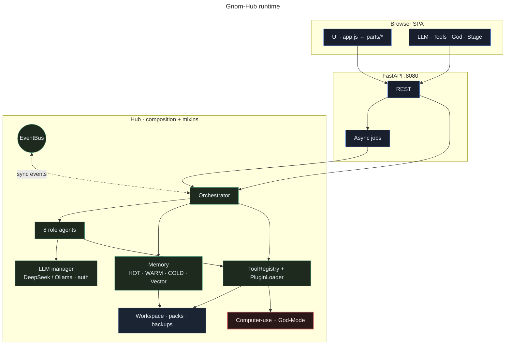
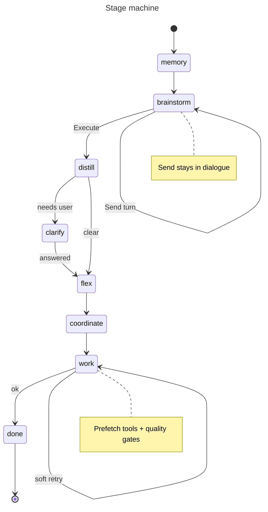
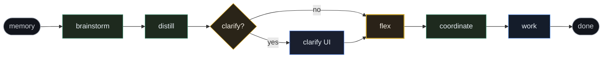
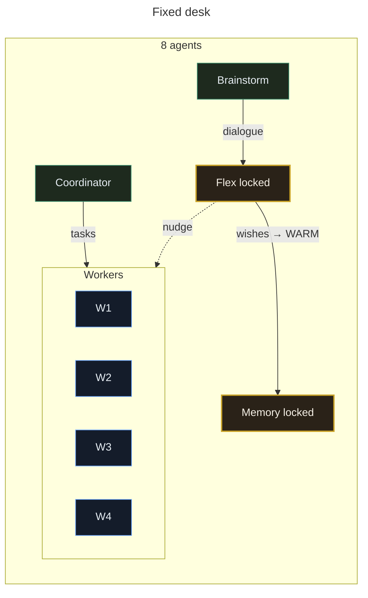
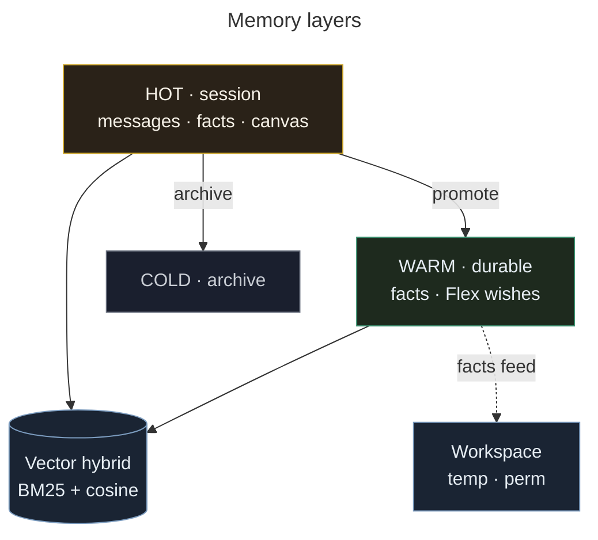
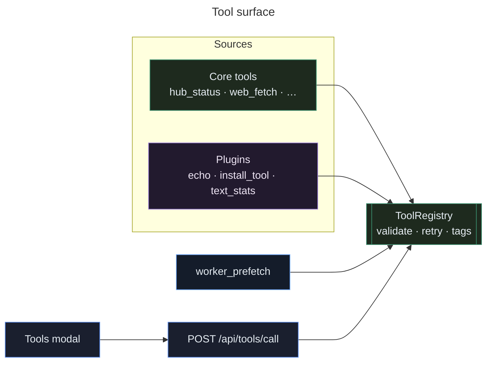

# Gnom-Hub Architecture (overview)

Short map of the running system. Deep dive: [CODE_ANALYSIS_FOR_AI.md](CODE_ANALYSIS_FOR_AI.md).  
Agent contracts: [AGENTS_DEFINITION.md](AGENTS_DEFINITION.md).  
Mermaid style guide + **class palette**: [MERMAID.md](MERMAID.md).  
MCP-lite tools server: [MCP_ARCHITECTURE.md](MCP_ARCHITECTURE.md).  
README diagrams: [README.md](../README.md) · [README_DE.md](../README_DE.md).

## One sentence

**Brainstorm freely; Execute only on purpose** — fixed eight-agent desk, local FastAPI + SPA, durable memory with Flex wishes protected.

## Runtime shape



ASCII (fallback):

```
Browser SPA (static parts → app.js)
       │  REST + job polling
       ▼
FastAPI  →  Hub (composition + mixins)
              ├── EventBus
              ├── Orchestrator (stages)
              ├── 8 role agents (LLM manager)
              ├── Memory HOT / WARM / COLD / Vector
              ├── ToolRegistry + Plugins
              ├── Workspace · packs · backups · jobs
              └── Computer-use (+ God-Mode dry-run default)
```

## Pipeline stages





| Mode | What runs |
|------|-----------|
| **Send** | Brainstorm turn + Flex absorb/co-talk; optional auto-Execute |
| **Execute** | Distill → clarify? → Flex briefing + wish inject → plan → **prefetch tools** → workers → quality + Flex nudge |
| **One-shot** | Tests / Telegram `/do` full path |

### Paths over time (sequence)

Rect colors match the palette in [MERMAID.md](MERMAID.md):  
`rgb(26,31,46)` = **ui** · `rgb(30,42,30)` = **core** · `rgb(42,34,24)` = **locked/hot** · `rgb(42,24,24)` = **danger**.

#### Send (brainstorm only)

```mermaid
---
title: Send · brainstorm turn
---
sequenceDiagram
  autonumber
  actor U as User
  participant SPA as SPA
  participant API as FastAPI
  participant O as Orchestrator
  participant B as Brainstorm
  participant F as Flex
  participant M as Memory
  participant L as LLM

  U->>SPA: Send message
  SPA->>API: POST chat / job
  API->>O: brainstorm turn

  rect rgb(26, 31, 46)
    Note over SPA,API: ui · request edge
    API-->>SPA: job id / poll
  end

  rect rgb(30, 42, 30)
    Note over O,L: core · dialogue
    activate O
    O->>M: load HOT / WARM context
    M-->>O: context
    O->>B: next turn
    activate B
    B->>L: chat
    L-->>B: reply
    B-->>O: brainstorm text
    deactivate B
  end

  rect rgb(42, 34, 24)
    Note over F,M: locked · Flex wishes
    O->>F: absorb / co-talk
    activate F
    F->>M: store source=flex wishes
    M-->>F: ok
    F-->>O: optional auto-Execute?
    deactivate F
  end

  alt auto-Execute intent clear
    O->>O: hand off to Execute path
  else stay in dialogue
    O-->>API: Box 2 update
    API-->>SPA: stage=brainstorm
    SPA-->>U: show Box 2
  end
  deactivate O
```



#### Execute (workers + tools)

```mermaid
---
title: Execute · full path
---
sequenceDiagram
  autonumber
  actor U as User
  participant SPA as SPA
  participant API as FastAPI
  participant O as Orchestrator
  participant F as Flex
  participant C as Coordinator
  participant P as Prefetch
  participant W as Worker(s)
  participant T as ToolRegistry
  participant M as Memory
  participant L as LLM

  U->>SPA: Execute
  SPA->>API: POST execute / job
  API->>O: run pipeline

  rect rgb(26, 31, 46)
    Note over SPA,API: ui
    API-->>SPA: poll snapshots
  end

  activate O
  O->>M: pipeline_context
  M-->>O: HOT + WARM + FLEX_WISHES

  rect rgb(30, 42, 30)
    Note over O,L: core · distill
    O->>L: distill requirements
    L-->>O: requirements
  end

  rect rgb(42, 34, 24)
    Note over F: locked · absolute wishes
    O->>F: briefing + inject wishes
    activate F
    F-->>O: binding_wishes
    deactivate F
  end

  O->>C: plan worker tasks
  activate C
  C->>L: plan / plan_mode
  L-->>C: tasks
  C-->>O: worker plan
  deactivate C

  rect rgb(30, 42, 30)
    Note over P,T: core · prefetch
    O->>P: tool_calls_needed(task)
    activate P
    opt URL in task
      P->>T: web_fetch
      T-->>P: page text
    end
    opt memory hints
      P->>T: memory_search
      T-->>P: hits
    end
    opt missing allowlisted dep
      P->>T: install_tool dry_run then install
      T-->>P: installed?
    end
    P-->>O: tool_calls[] + context
    deactivate P
  end

  loop each planned worker
    O->>W: run(task, wishes, tool context)
    activate W
    alt usable LLM key
      W->>L: generate deliverable
      L-->>W: draft
    else placeholder / 401 / no key
      rect rgb(42, 24, 24)
        Note over W,L: danger · no fake stub
        W-->>O: FEHLER (honest)
      end
    end
    opt worker-initiated tool
      W->>T: tools.call
      T-->>W: result
    end
    W-->>O: draft or FEHLER
    deactivate W
  end

  alt FEHLER auth / non-fixable
    rect rgb(42, 24, 24)
      Note over O,U: danger · skip Flex re-run
      O-->>API: stage done/error + FEHLER
    end
  else quality gap fixable
    O->>O: quality gates
    loop soft retries max 2
      O->>W: rewrite
      W-->>O: draft
    end
    opt still gaps
      O->>F: nudge_gaps
      F-->>W: correction hint
      W-->>O: revised draft
    end
    O->>M: write results / facts
    M-->>O: ok
    O-->>API: Box 3 + quality_notes
  else quality ok
    O->>M: write results / facts
    M-->>O: ok
    O-->>API: Box 3 deliverable
  end

  deactivate O
  API-->>SPA: snapshot (Tools badge, stage)
  SPA-->>U: Preview / Source
```



#### Tools API (manual call)

```mermaid
---
title: Tools modal / API call
---
sequenceDiagram
  autonumber
  actor U as User
  participant SPA as SPA
  participant API as FastAPI
  participant T as ToolRegistry
  participant Plug as Plugin handler

  U->>SPA: Tools modal · Call
  SPA->>API: POST /api/tools/call

  rect rgb(26, 31, 46)
    Note over SPA,API: ui
  end

  API->>T: call(name, args)
  activate T
  T->>T: validate required args
  alt unknown tool
    T-->>API: KeyError + available list
  else core tool
    rect rgb(30, 42, 30)
      T->>T: handler
    end
    T-->>API: result
  else plugin tool
    rect rgb(34, 26, 46)
      Note over T,Plug: plugin
      T->>Plug: run(...)
      Plug-->>T: ok/fail payload
    end
    T-->>API: result
  end
  deactivate T
  API-->>SPA: JSON
  SPA-->>U: show result
```



## Agents (fixed roster)



| Agent | Role | Toggle |
|-------|------|--------|
| Brainstorm | Multi-turn ideas | on |
| Memory | Recall + durable facts | on, locked |
| **Flex** | Fixed proxy: wishes → WARM, co-talk, Execute trigger, nudge | on, **locked** |
| Coordinator | Distill + plan | on |
| Worker 1–4 | Deliverables | 1–2 on; 3–4 toggleable |

Flex details: standing `User:` / `Wish:` facts (`source=flex`), never trimmed before non-flex, injected as absolute orders into worker DoD.

## Memory



| Layer | Lifetime | Role |
|-------|----------|------|
| HOT | Session | Messages, session facts |
| WARM | Durable | Long-lived facts; **flex reserve** on trim |
| COLD | Archive | Past sessions |
| Vector | Durable | Hybrid BM25 (88%) + cosine (12%), flex_wish boost |
| Workspace | Artifacts | Temp / permanent after execute |

`pipeline_context` puts **FLEX_WISHES** first with its own budget.

## Tools & plugins



## Plan modes

| Mode | Behavior |
|------|----------|
| `default` | Auto full-page HTML when task looks like a page; else LLM/stub split |
| `full_page_html` | Exactly one worker, one complete HTML file |
| `plan_qa` / `diagnosis` | Deterministic multi-worker templates |

## Quality gates (workers)

HTML: complete `</html>`, real interaction, structure-before-CSS. Soft retries (max 2) on incomplete_html / missing_interaction / gate_fail. Flex `nudge_gaps` after quality notes — **skipped** on auth / non-fixable errors.

## Testing layers

| Layer | Command |
|-------|---------|
| Unit/integration | `pytest tests/ -q` |
| Fast mutation | `python scripts/mutation_check.py` |
| Vector rank-eval | `python scripts/vector_rank_eval.py` |
| Deep mutmut | `./scripts/run_mutmut.sh` ([MUTMUT.md](MUTMUT.md)) |
| Nightly mutation | GitHub Actions `mutation-nightly.yml` |

## What this is not

- Not a second workflow engine (no Ruffus/Airflow in the hot path)
- Not multiplayer / unattended full autonomy
- Not a cloud lock-in: keys in `User/Key.txt`, data under `data/`
- **Not Docker / Compose / K8s** — run with `./scripts/start.sh` and a local `.venv` only

## Key source paths

| Area | Path |
|------|------|
| Orchestrator | `src/gnom_hub/pipeline/orchestrator.py` |
| Flex / Brainstorm | `src/gnom_hub/agents/roles.py` |
| Coordinator / Workers | `src/gnom_hub/agents/roles_ext.py` / `roles_workers.py` |
| Helpers (clarify, flex meta) | `src/gnom_hub/agents/roles_helpers.py` |
| Memory facade | `src/gnom_hub/memory/facade.py` |
| Vector BM25 | `src/gnom_hub/memory/vector_store.py` |
| SQLite WARM | `src/gnom_hub/memory/sqlite_store.py` |
| Tool registry | `src/gnom_hub/plugins/registry.py` |
| Plugin loader | `src/gnom_hub/plugins/loader.py` |
| Prefetch | `src/gnom_hub/tools/worker_prefetch.py` |
| Auth keys | `src/gnom_hub/config/keys.py` · `config/auth.py` |
