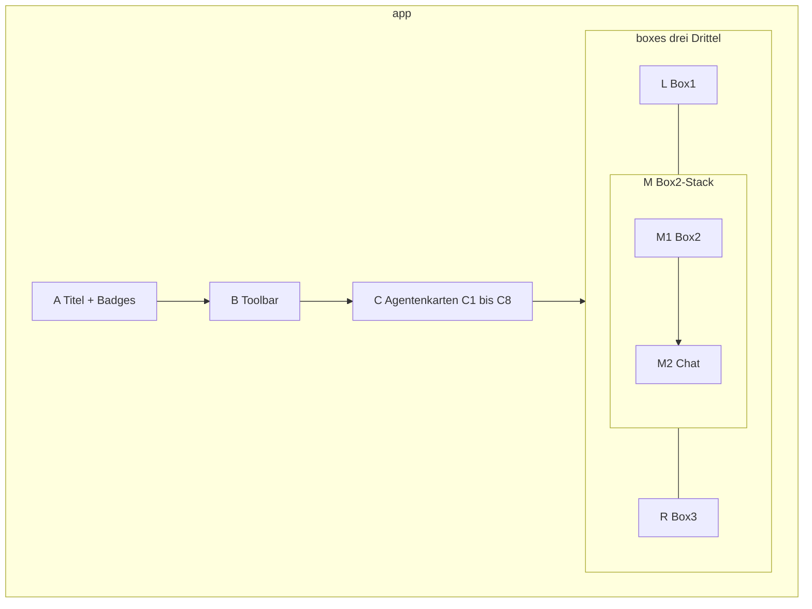
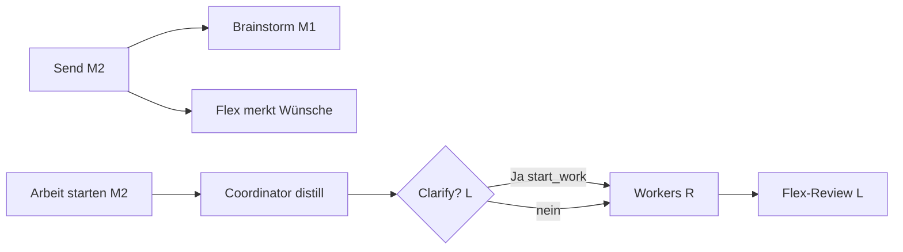

# Desk-UI-Karte — Gnom-Hub-V1

Damit eine andere KI (und du) **sofort** sieht, wie der Desk aussieht und klickt.  
Quelle: `src/gnom_hub/ui/static/index.html` + `app.css` + `parts/*.js`. Code gewinnt bei Drift.

**Raster zum Reden:** dieselben Zellen-IDs hier, im PNG `docs/assets/human-ui-audit/desk-grid.png` und in Notion. Sag z.B. „M2 höher“ statt „das Chat unter Box 2“.

Stand: Branch `test/human-ui-audit`, Draft-PR 57. Cache `app.css?v=160` / `app.js?v=160`.

---

## 1. Raster (Zellen)

Drei gleiche Spalten unten: **L** | **M** | **R**. M ist vertikal halbiert.

```
┌──────────────────────────────────────────────────────────────┐
│ A   Titel + Badges                                           │
├──────────────────────────────────────────────────────────────┤
│ B   Toolbar                                                  │
├──────────────────────────────────────────────────────────────┤
│ C   C1 Brainstorm  C2 Memory  C3 Flex  C4 Coordinator        │
│     C5 Worker1     C6 Worker2 C7 Worker3 C8 Worker4          │
├────────────────┬─────────────────────┬───────────────────────┤
│ L  Box 1       │ M1  Box 2           │ R  Box 3              │
│ 1/3 Breite     │ oben 50 % von M     │ 1/3 Breite            │
│ volle Höhe     ├─────────────────────┤ volle Höhe            │
│                │ M2  Chat            │                       │
│                │ unten 50 % von M    │                       │
└────────────────┴─────────────────────┴───────────────────────┘
```

| Zelle | Fläche | DOM | Breite / Höhe |
|-------|--------|-----|----------------|
| A | Titel + Badges | `.top-bar-head` | volle Breite |
| B | Toolbar | `.top-toolbar` | volle Breite |
| C | 8 Agentenkarten | `#agent-cards` | volle Breite, 8 gleich |
| C1–C8 | eine Karte | gebaut in JS | Reihenfolge Brainstorm→Worker4 |
| L | Box 1 | `#box1` | 1/3, volle Box-Höhe |
| M | Box2-Spalte | `#box2-stack` | 1/3 (Hälfte von `.boxes-right`) |
| M1 | Box 2 | `#box2` | 50 % von M |
| M2 | Chat | `#chat-mod` | 50 % von M |
| R | Box 3 | `#box3` | 1/3, volle Box-Höhe |

`.boxes` = Flex-Row. `#box1` `flex: 0 0 33%`. `.boxes-right` = 66 %, darin `#box2-stack` und `#box3` je 50 % → visuell drei Drittel.



---

## 2. Verschachtelung (HTML)

```
#app
├── header.top-bar                          A + B
│   ├── .top-bar-head                       A
│   └── .top-toolbar                        B
├── #agent-cards                            C
└── section.boxes
    ├── #mobile-box-tabs                    nur Mobile
    ├── #box1                               L
    │   ├── #box1-layers                    8 Agent-Layer (Klick)
    │   └── #box1-content                   Overlay, nicht per-Agent
    │       └── #box1-layer-live
    │           ├── .box1-placeholder
    │           ├── #flex-ask               Flex-Fragen (gelb)
    │           ├── #flex-review            Flex-Feedback nach done
    │           ├── #box1-tooltip
    │           ├── #box1-choice-cards      Anklick-Karten (Farbe = Owner)
    │           ├── #cold-browser
    │           ├── #clarify
    │           └── #deferred-clarify
    └── .boxes-right
        ├── #box2-stack                     M
        │   ├── #box2                       M1
        │   │   ├── #box2-layers
        │   │   └── #box2-page-stage        HTML-Seite, Overlay
        │   └── #chat-mod                   M2
        │       └── #chat
        │           ├── #chat-layers
        │           ├── .chat-input-row
        │           └── #chat-flags
        └── #box3                           R
            ├── #box3-layers
            ├── #box3-dual                  legacy
            ├── #box3-result-stage
            └── #tune-layer                 Regler nur in R
```

Modals hängen **außerhalb** von `#app` am `body`: Workspace, System, Vector, Docs, Skills, Tools, Usage. Toasts: `#toast-host`.

---

## 3. Zelle A — Titel + Badges

| id | Label | Klick |
|----|-------|-------|
| (h1) | Gnom-Hub + `#ver-badge` | — |
| `#llm-badge` | LLM-Key | Anzeige |
| `#cost-badge` | $ | öffnet Usage-Modal |
| `#mem-badge` | HOT memory | Anzeige |
| `#vec-badge` | Vec | Vector-Modal |
| `#god-badge` | God: off/on | Toggle. **off** = Shell/GUI dry-run |
| `#cold-badge` | Cold | COLD-Browser in **L** |
| `#docs-badge` | Docs | Docs-Modal |
| `#skills-badge` | Skills | Skills-Modal |
| `#tools-badge` | Tools: n | Tools-Modal |
| `#stage-badge` | idle/brainstorm/… | Anzeige |

---

## 4. Zelle B — Toolbar

| id | Label | Wirkung |
|----|-------|---------|
| `#flex-preset-select` | Flex Personal (fixed) | **disabled** — Rolle nicht wechselbar |
| `#btn-workspace` | Workspace | Temp / Permanent Dateien |
| `#btn-tools` | Tools | Tools-Modal |
| `#btn-clear-chat` | Clear chat | nur Browser-Chatlog |
| `#btn-system` | System | Keys, Budget, HOT/WARM, Packs, Teams |
| `#btn-help` | Help | Hilfe |
| `#btn-archive` | Archive | HOT → COLD |
| `#btn-reset` | Reset | archiviert HOT, dann Session leer. **Löscht keine Flex-Wünsche** |
| `#btn-save` | Save | HOT + Agent-State |

---

## 5. Zelle C — Agentenkarten

Acht Karten, gleiche Breite, Reihenfolge = Pipeline-Nähe.

Klick auf Karte:

1. Layer in **L, M1, R** und Chat-Layer auf diesen Agent
2. 1px Modulrahmen in Agentfarbe
3. **L** zeigt Agent-Info (Rolle, Modell, Regler-Tip) — nicht den Chat

| Zelle | id | Farbe CSS | Token |
|-------|-----|-----------|-------|
| C1 | brainstorm | `#ef5350` | `--c-brainstorm` |
| C2 | memory | `#42a5f5` | `--c-memory` |
| C3 | flex | `#f0c000` | `--c-flex` — **gelb, nicht Lila** |
| C4 | coordinator | `#26c281` | `--c-coordinator` |
| C5 | worker1 | `#29b6f6` | `--c-worker1` |
| C6 | worker2 | `#8b6cf6` | `--c-worker2` |
| C7 | worker3 | `#ec5f9b` | `--c-worker3` |
| C8 | worker4 | `#ff8a3d` | `--c-worker4` |

Doppelklick Worker 3/4 kann Enable togglen (System-Hinweis). Memory und Flex sind locked on. Flex-Preset/Toggle wirkungslos.

TTS-Checkbox auf der Karte: default **an** für Brainstorm und Flex.

---

## 6. Zelle L — Box 1 (Rückfragen)

**Owner der Fläche:** Flex (Fragen) + UI (Info/COLD) + Brainstorm nur als **farbmarkierte** Choice-Karten. Workers schreiben **nicht** nach L.

Scrollbalken unsichtbar, Inhalt scrollbar (`overflow-y: auto; scrollbar-width: none`).

### Innen, von oben

| id | Default | Farbe | Was |
|----|---------|-------|-----|
| `.box1-placeholder` | sichtbar | — | „Agent-Klick → Info hier“; weg sobald Flex-Ask offen |
| `#flex-ask` | hidden | gelb `--c-flex` | eine offene Frage (`qs.slice(0,1)`), `textContent` only |
| `#flex-review` | hidden | gelb | nach Execute `done`: Gut/Mittel/Schlecht, Wünsche merken. **Kein Execute** |
| `#box1-tooltip` | hidden | — | Hilfe-Text |
| `#box1-choice-cards` | hidden | **Owner-Farbe** | Anklick-Karten. Brainstorm = rot, Flex = gelb, Coordinator = grün |
| `#cold-browser` | hidden | — | Archive restore/delete |
| `#clarify` | hidden | — | Yes/No/Whatever/Later (meist durch FlexDesk ersetzt) |
| `#deferred-clarify` | hidden | — | Parked Later |

`#box1-layer-tune` / `#box1-layer-gnom`: Info-Layer, nicht Live.

### Flex-Ask Komponenten

`text` · `yes_no` · `later` · `single_select` · `multi_select` · `free_text` · `start_work`

Ja auf start_work oder Klick **Arbeit starten** (M2) startet Worker. Flex selbst startet nichts.

Start-Text (fest):

> START-C1 — Auftrag C1 ist ausführbar. Soll genau dieser Auftrag jetzt starten?

Choice-Karten in L sind **nicht** Flex, wenn Brainstorm eine Liste (`1.` / `-`) geschrieben hat. Kleine Farbmarke + linker Streifen sagt wer.

---

## 7. Zelle M1 — Box 2

**Owner:** Brainstorm-Dialog (Turns). Overlay `#box2-page-stage` kann fertiges HTML zeigen (nicht Popup).

`#box2-page-close` schließt die Seite, Brainstorm wieder sichtbar.

Agent-Layer `#box2-layers`: Klick auf C zeigt den Layer dieses Agenten. Schreiben darf Brainstorm (und Flex-Notizen auf Execute-Pfad).

---

## 8. Zelle M2 — Chat

Steht **in** `#box2-stack` unter M1, nicht unter allen drei Boxen.

| id | Label | Wirkung |
|----|-------|---------|
| `#chat-layers` | Log | pro Agent ein Layer; scrollbar **ohne** Balken |
| `#btn-mic` | Mic | Browser-STT in die Eingabe |
| `#btn-td` | TD | ThreadDesk-Paket in die Eingabe, **kein** Send |
| `#chat-input` | Textarea | Enter = Send, Shift+Enter = Zeile, Ctrl/Cmd+Enter = Arbeit starten. Scrollbar unsichtbar |
| `#btn-send` | Send | `POST /api/chat` + Ziel-Flag. **Kein Execute** |
| `#btn-execute` | Arbeit starten | `POST /api/execute` = Distill + Worker. Default disabled bis bereit |
| `#chat-targets` | An BS/Co/Flex/Wn | Empfänger der nächsten Nachricht, getrennt vom Kartenklick |
| `#btn-cancel` | Cancel | hidden bis Job läuft; Esc |
| `#chat-flags` | Flags | stehende Wünsche an die nächste Zeile |

Chat-Zeilen: ⧉ kopieren, ★ merken (`POST /api/memory/warm`). Who-Label in Agentfarbe.

Toast nach Send: `Send = sprechen · Arbeit starten / Ja in Box 1 = Arbeit`.

---

## 9. Zelle R — Box 3

**Owner:** Worker-Deliverables.

| id | Was |
|----|-----|
| `#box3-result-stage` | nach Execute sichtbar |
| `#box3-worker-tabs` | welcher Worker |
| `#box3-btn-copy` | Copy |
| `#box3-btn-dl` | Download |
| `#box3-btn-open` | Seite in M1+R (Shift = Browser-Tab) |
| `#box3-btn-keep` | HTML dauerhaft `selected/` |
| `#box3-btn-temp` | Temp-Workspace |
| `#box3-btn-perm` | Permanent-Workspace |
| `#box3-result-fs` | Vollbild in `.boxes` |
| `#box3-tool-strip` | Tool-Chips dieses Runs |
| `#box3-dod-checklist` | DoD-Gate |
| `#box3-result-body` | HTML oder Text |
| `#tune-layer` | nur in R: Temperature, Top-P, Max Tokens, Penalties, TTS, Model, Key, Extra-Prompt |

FEHLER-Banner wenn Worker kein Deliverable hat.

---

## 10. Modals (über dem Desk)

| Modal | Öffner | Inhalt |
|-------|--------|--------|
| `#workspace-modal` | B Workspace | Temp / Permanent Listen, Preview, zip |
| `#system-modal` | B System | Budget, Model, Lang, Checkpoint, Pack, HOT/WARM, Worker-Presets, Team, plan_mode |
| `#vector-modal` | A Vec | Embedder, Search, Add |
| `#docs-modal` | A Docs | lokale Doc-Suche |
| `#skills-modal` | A Skills | Playbooks laden/installieren |
| `#tools-modal` | A Tools / B Tools | Registry, Run, Fetch, Computer-use (God) |
| `#usage-modal` | A $ | Spend + Jobs |

---

## 11. Klick-Logik kurz



- Agentkarte C → Layer in L+M1+R+Chat
- Send ≠ Execute
- Flex in L hat **keine** Autorität
- God-Badge A steuert echte Desktop-Aktionen

---

## 12. Dateien

| Was | Datei |
|-----|--------|
| Markup | `src/gnom_hub/ui/static/index.html` |
| CSS | `src/gnom_hub/ui/static/app.css` |
| JS | `parts/00-preamble.js` … `05-init.js` → `scripts/build_ui_js.py` → `app.js` |
| Tooltips | `src/gnom_hub/ui/tooltips.py` |
| Rechte/Prompts | [AGENTS_PROMPTS.md](AGENTS_PROMPTS.md) |
| Flex-Vertrag | [UI-STATE-CONTRACT.md](UI-STATE-CONTRACT.md) |
| Box-wer-schreibt | [GNOM-HUB-V1-WORKER-BOX-CONTRACT.md](GNOM-HUB-V1-WORKER-BOX-CONTRACT.md) |

Beschriftetes Foto: [desk-grid.png](assets/human-ui-audit/desk-grid.png)
