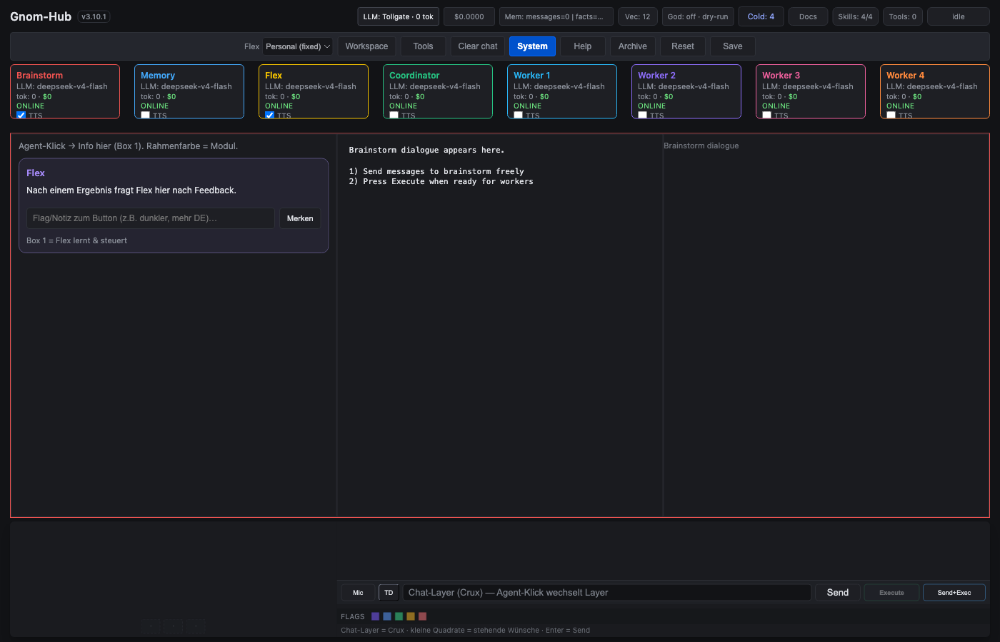
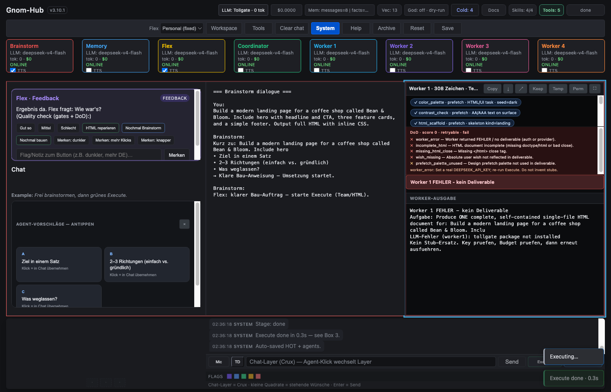
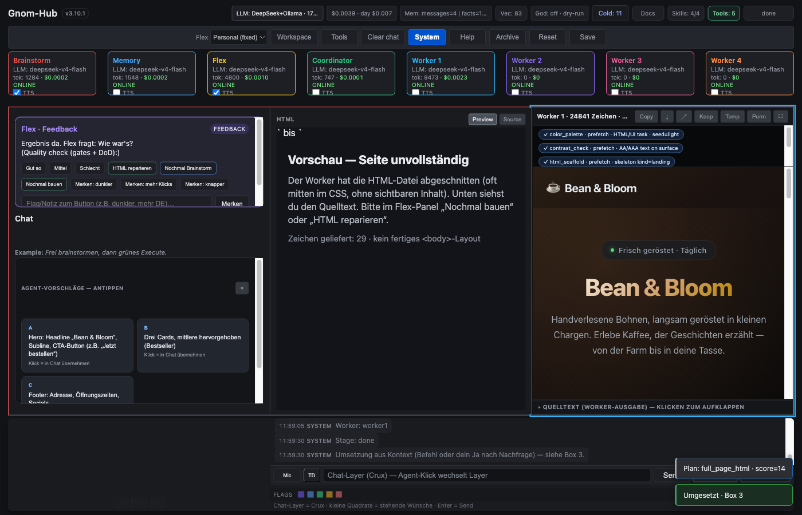

# Gnom-Hub-V1 — Human UI audit

**Project:** Gnom-Hub-V1  
**Branch:** `test/human-ui-audit` (from `origin/main`)  
**Base commit:** `06cfcc592e9c0f2c2ddb760185c10b41cf29bdf4`  
**Date:** 2026-09-10

## Test environment

| Item | Value |
|------|--------|
| OS | macOS 15.7.4 (Darwin 24.6.0 x86_64) |
| Python | 3.12.13 (worktree `.venv`) |
| Node | v25.9.0 |
| App | isolated worktree `/Users/landjunge/gnom-hub-v1-ui-audit` |
| Data | `GNOM_WS=/Users/landjunge/gnom-hub-v1-ui-audit-ws` (not the live desk) |
| UI | `http://127.0.0.1:8090/` (live user desk on `:8080` left running) |
| Tollgate | HTTP `http://127.0.0.1:8787` (user process). Round 1 had **no** `tollgate` package in the venv |
| God-Mode | off (dry-run) |
| Headed E2E | Playwright Chromium, `GNOM_E2E_HEADED=1` |
| Open PRs not touched | #56 Mutation Nightly venv cache; #49 sandbox revive |

Official `./scripts/install.sh` was run in the worktree. It does **not** install Tollgate. Default `GNOM_TOLLGATE_LLM=1` then makes workers return FEHLER.

## How the three boxes actually work

Send is **not** a pure brainstorm button in code. Default path: Memory → Brainstorm → Flex chat, Box 2 only. Execute: distill → optional Box 1 clarify → Flex → Coordinator → sequential workers → Box 3.

Exceptions that start workers from Send: tool drill, live browser nav, go-only (`ja` / `mach das` / `execute`), Flex execute request, and **HTML/build language** (`baue`, `landing page`, …). The last group contradicts `AGENTS.md`.

Box 1 is not an “Arounder” agent. It is Flex review + Coordinator clarify + agent info + COLD. Box 2 is brainstorm. Box 3 is workers.

## Screenshots

| State | File |
|-------|------|
| Start (idle, Execute disabled, God off) | `docs/assets/human-ui-audit/start.png` |
| After Send with build language, no Tollgate package | `docs/assets/human-ui-audit/box3-fehler-no-tollgate.png` |
| Stage `done` + toast Execute done, no HTML | `docs/assets/human-ui-audit/execute-done-without-deliverable.png` |
| With Tollgate, worker budget FEHLER | `docs/assets/human-ui-audit/box3-fehler-budget.png` |
| Clarify in Box 1 (S3) | `docs/assets/human-ui-audit/clarify-box1.png` |
| Tools modal (S5) | `docs/assets/human-ui-audit/tools-modal.png` |

## Box 1 / 2 / 3 cases

| Case | Result |
|------|--------|
| Start: boxes visible, Execute disabled, God off | PASS |
| Reload | PASS (state from `/api/state`) |
| Vague ideation Send (`nur Brainstorm`) | PASS — stage `brainstorm`, 0 workers |
| Follow-up Send still brainstorm | PASS |
| Empty Send | PASS — HTTP 422 |
| Double Send | PASS — second HTTP 409 |
| Send with “Build a landing page…” | **FAIL vs audit rule Send≠Execute** — auto-executes, 1 worker, stage `done` |
| Execute after ideation | PASS — workers start; 4 workers when all enabled |
| Clarify Yes/No/Whatever/Later | PASS (S3 headed) |
| Worker HTML landing (S1) | **PASS** on isolated `:8090` with `GNOM_TOLLGATE_LLM=0` (legacy DeepSeek): `RESULT.html` 24 830 chars, DoD 7/7. Round 1 without Tollgate package FAIL; round 2 Tollgate budget FAIL; e2e also failed once despite HTML because Box 2 preview hid brainstorm text |
| Cancel Execute immediately | PASS — job `cancelled` |
| Cancel after fast finish | job already `done` (race documented) |
| God stays off after chat/execute | PASS |
| Computer-use without God | PASS — dry-run; inspect blocked |
| Tools modal | PASS (S5) |
| ThreadDesk TD | fills input, does not Send (code + GET) |
| Clean/Reset | Clean used between API cases; WARM kept |

## Control matrix (summary)

Full inventory: see agent report in session notes. Status key: works / partial / dead / placeholder.

| Control | Status |
|---------|--------|
| Send, Enter | works (may auto-execute) |
| Execute, Ctrl+Enter | works when `can_execute` |
| Send+Exec | works |
| Cancel, Esc (job) | works |
| Mic | works if browser STT exists |
| TD | works (no auto-send) |
| Agent cards / layers | works |
| Clarify Yes/No/Whatever/Later | works |
| Flex review buttons | works after done (even after FEHLER — misleading) |
| God badge | works; confirm on enable |
| Tools / Workspace / System / Vector / Docs / Skills | works |
| Flex preset select | **placeholder** (disabled) |
| Chat left `·` slots | **placeholder** (disabled) |
| `#box1-layer-gnom` | **dead** (never shown) |
| `#box3-dual`, Copy-all, Diff, History, Re-Exec, job timer, busy banner | **dead** (JS leftover, no HTML) |
| Esc closes System/Workspace/Docs/Skills/Tune/COLD | **does not** |
| Mobile box tabs | present at ≤640px (not re-tested on a phone) |

## Confirmed findings

1. **Send can start workers** on HTML/build language and go-only. Audit rule “Send is never Execute” fails. Product tests encode the current behavior.
2. **Official install without Tollgate:** workers return `FEHLER — tollgate package not installed`. UI still `stage=done` and toasted “Umgesetzt / Execute done”.
3. **With Tollgate wired:** S1 still produced no HTML (budget / Protect classified as `GNOM_MAX_BUDGET_USD`). E2E waited 180s.
4. **`stage=done` is not “fertig mit Ergebnis”.** `_finish` clears `error`. Box 3 DoD can be score 0 / FEHLER while the badge says `done`.
5. Worker 3/4 are **on** by default; several docs say off.
6. Per-worker `TOOL_CALL` loop was not wired on Hub boot (`tools=None` overwrite). **Fixed** on this branch.
7. Localhost API has **no auth**. `POST /api/god-mode`, `/api/tools/call`, `/api/chat?full=1` bypass the buttons (trusted local desk model).
8. Plugins are unsandboxed. Playwright / `file_read` / `install_tool` skip God-Mode. `workspace/write` **is** jailed (`Path(name).name`).
9. God-Mode is process-global; does not persist across restart (safe). Chat cannot enable it.

## Unconfirmed guesses

- Whether a full Bean & Bloom HTML landing succeeds on the **live** `:8080` desk with the user’s Tollgate budget.
- CSRF from a visited site to `127.0.0.1:8080` (in scope as a local-desk threat, not live-tested).
- Mobile layout on a real phone.

## Security (short)

See `docs/GNOM-HUB-V1-TEST-RESULTS.json` findings `SEC-01` … `SEC-12`. Dry-run stayed on. Chat did not enable God-Mode. Computer-use inspect blocked. Shell without God was dry-run.

## Remaining risks

- Fresh `install.sh` without sibling Tollgate → workers cannot talk to cloud LLM.
- Auto-execute on Send for landing pages (cost + tools without an Execute click).
- False “done” if `deliverable_ok` is ignored by other UI paths (Flex review still asks “Wie war’s?” after FEHLER).
- Cooperative cancel; in-flight tools are not rolled back.
- `file_read` of hub `.env`; `pw_screenshot` path; `shell_safe` without path jail when God is on.

## Honest verdict

Gnom-Hub-V1 **desk chrome works**. Box 1/2/3 light up. Send can brainstorm. Execute starts workers. Cancel, 409-busy, God-off dry-run, Tools modal, and clarify are real.

S1 can deliver a real Bean & Bloom page in Box 3 when the worker LLM path has budget (`GNOM_TOLLGATE_LLM=0` in this isolated run). Default Tollgate still fails workers when the shared consumer budget is spent. Agent Authority Lab should not assume Tollgate is always ready.

Automated gates on this commit (venv + worktree): ruff, format, **546 pytest**, mermaid, eslint, mutation 33/33, vector rank, smoke, prepush — all green **before** the audit repairs. New tests: `tests/test_deliverable_ok.py`.
