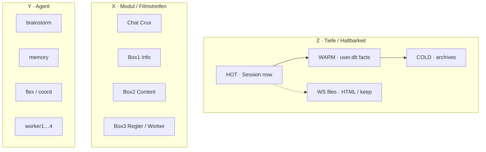
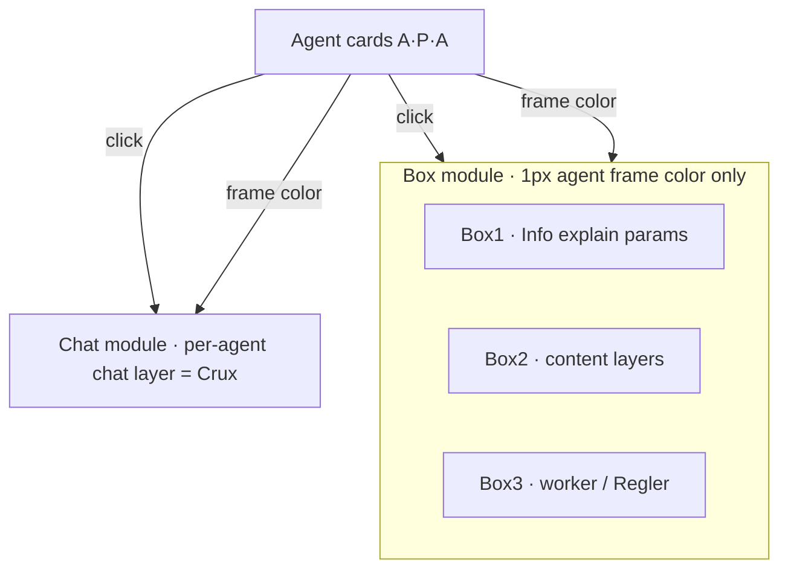
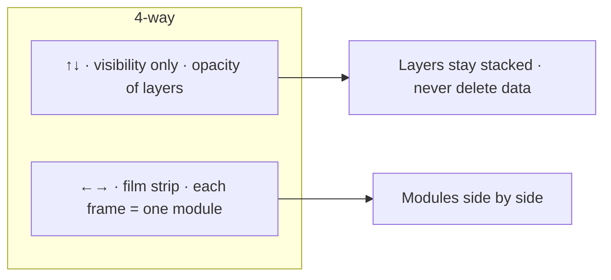
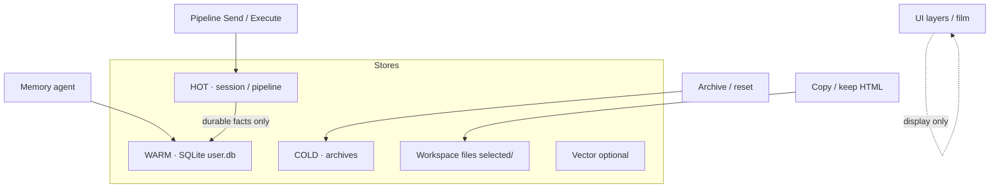
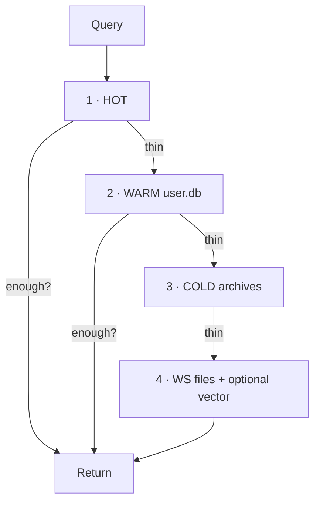
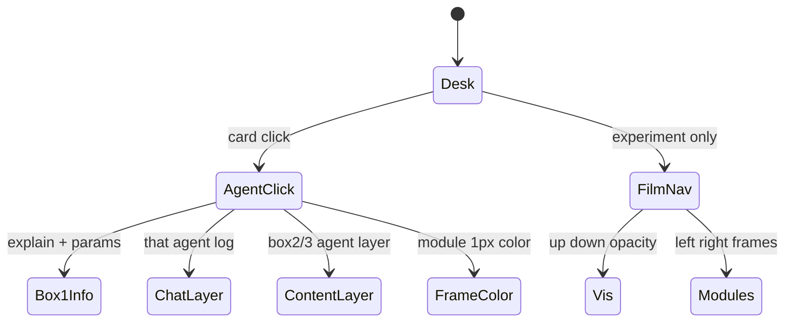

# Layers — map for AI (and humans)

Mental model only. **UI = visibility + modules. DB = tiered store. Search = walk tiers outward.**

## 1. Three axes (3D map, not 3D UI)

**Cell address (concept):** `agent × module × tier`  
Example: `memory × facts × WARM` · `worker1 × result × HOT/WS`

---

## 2. UI desk layers (what the human sees)

**Rules (do not invent opposite):**

- Agent click → module frame color **only** (not individual box borders).
- Box1 = agent explain + params · Box3 = tune/Regler · Chat = crux layer.
- Agent layers in boxes 1/2/3; chat has own per-agent layer.

---

## 3. Navigation (Clown Lab / film idea)

---

## 4. Data tiers (where truth lives)

| Tier | Write | Clear-safe? |
|------|--------|-------------|
| HOT | session, jobs | yes often |
| WARM | durable facts | no (keep) |
| COLD | archived HOT | restore/delete explicit |
| Files | HTML artifacts | Clear temp ≠ keep selected |

---

## 5. Search over large data (when layers matter)

**AI rule:** prefer inner tiers first; escalate depth only if needed. Do not dump COLD+WS into every prompt.

---

## 6. One diagram for “what am I looking at?”

---

## 7. Do / Don’t (for agents editing the hub)

**Do**

- Keep HOT / WARM / COLD semantics when touching memory.
- Route agent explain to Box1; Regler to Box3; chat to active agent layer.
- Treat layer UI as visibility/navigation, not as deleting stores.

**Don’t**

- Put full HTML into WARM.
- Paint individual box borders with agent color (module frame only).
- Build literal 3D database UI unless user asks for experiment.

---

*Source of product truth remains code + user.db + WS. This file is the shared map.*
