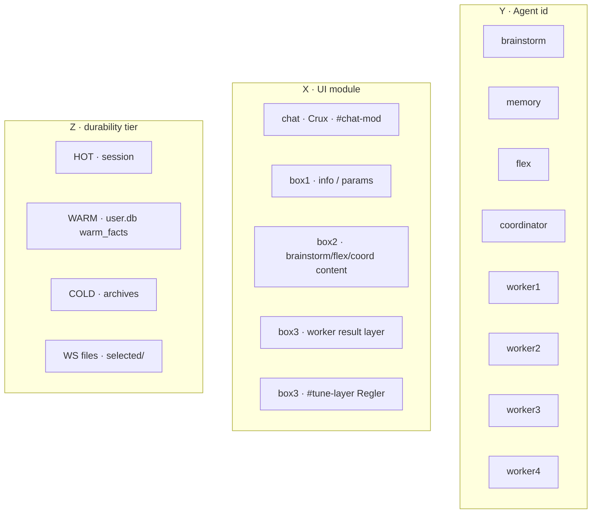
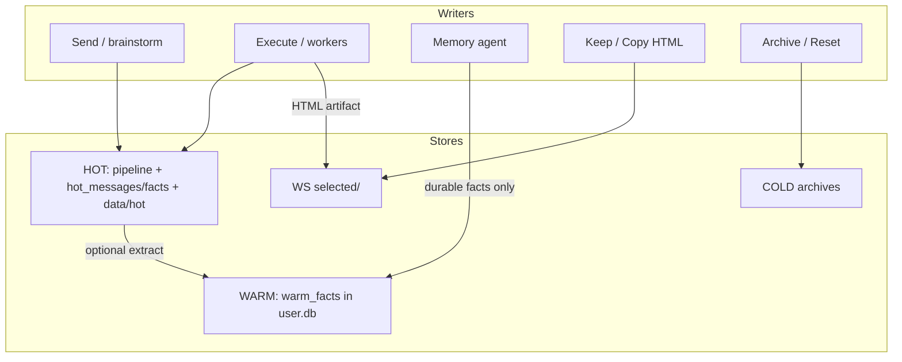
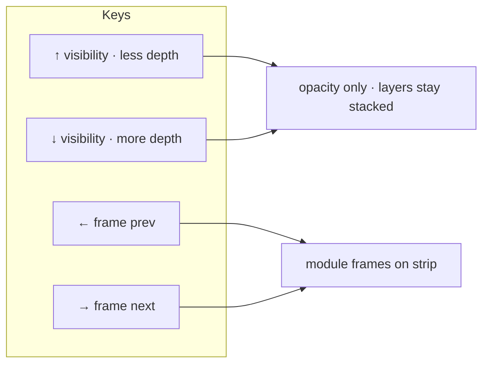
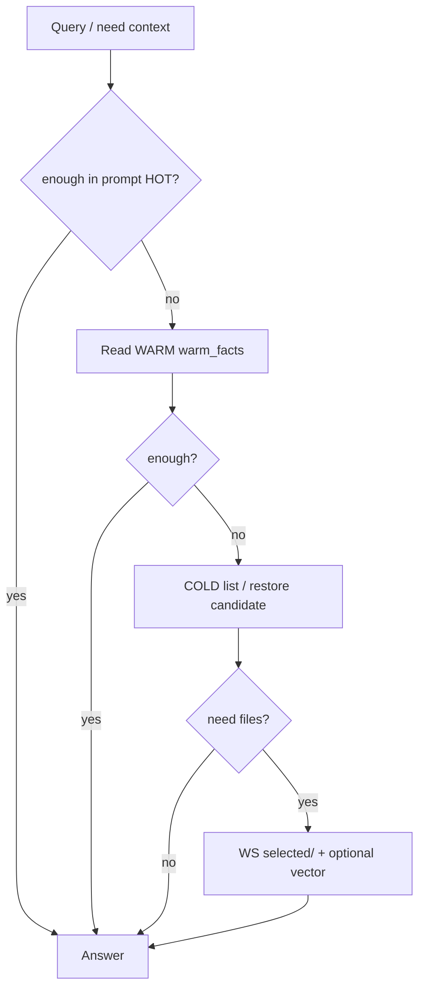

# Layers — precise map for AI (and humans)

This is the **canonical mental model** for Gnom-Hub v1 UI + storage.  
Code wins if this file drifts. Last aligned with main ~UI v148 / Clown Lab nav.

---

## 0. One sentence

**UI layers control what you see and click. Data tiers control what survives. Navigation must never delete storage.**

---

## 1. Disk layout (real paths)

```
/Users/…/gnom-hub-v1/              ← CODE (hub)
  src/gnom_hub/…
  data/hot/                        ← HOT mirrors under hub (session tools, canvas)
  data/offload/                    ← large HOT offload blobs

/Users/…/WS-gnom-hub-v1/           ← PERSONAL (or $GNOM_WS)
  User/
    user.db                        ← LIVE SQLite (source of truth for HOT rows + WARM)
    Key.txt                        ← keys (not in git)
  selected/                        ← permanent HTML keep (Copy / keep API)
  backups/
    user.db                        ← latest mirror of user.db
    user-YYYYMMDD-….db             ← dated keeps (rotation)
```

**Rule (`paths.py`):**

| Path | Meaning |
|------|---------|
| `project_root()` | Hub code root |
| `personal_workspace()` | `GNOM_WS` or sibling `WS-gnom-hub-v1` |
| `user_dir()` | `{WS}/User` |
| `selected_dir()` | `{WS}/selected` |
| Live DB | `{WS}/User/user.db` (override: `GNOM_USER_DB` / `GNOM_DB_PATH`) |

Hub temp clutter is **clearable**. Personal WS is **yours** — Clear must not wipe `selected/` or WARM by default.

---

## 2. Three axes (address space)

Not a 3D product UI — a **coordinate system** for agents and storage.

| Axis | Name | Values (concrete) |
|------|------|-------------------|
| **Y** | Agent | `brainstorm`, `memory`, `flex`, `coordinator`, `worker1`…`worker4` |
| **X** | Module / surface | `chat`, `box1-info`, `box2-content`, `box3-worker`, `box3-regler` |
| **Z** | Tier / durability | `HOT`, `WARM`, `COLD`, `WS-file`, `vector?` |

**Cell address:** `Y × X × Z`  
Examples:

| Cell | Meaning |
|------|---------|
| `memory × facts × WARM` | row in `warm_facts` |
| `brainstorm × chat × HOT` | dialogue / hot_messages + UI chat layer |
| `worker1 × result × WS-file` | HTML under `selected/` after Keep |
| `worker1 × result × HOT` | last pipeline worker output in session |
| `* × archive × COLD` | COLD restore pack |



---

## 3. Data tier Z — exact stores

### 3.1 SQLite `user.db` (personal)

**File:** `{GNOM_WS}/User/user.db`  
**Code:** `src/gnom_hub/db/sqlite_store.py` · `GnomDatabase`

| Table | Tier role | Content |
|-------|-----------|---------|
| `warm_facts` | **WARM** | durable fact `text`, `source`, `ts` · UNIQUE on text |
| `hot_messages` | **HOT** | session messages `role`, `content`, `ts` |
| `hot_facts` | **HOT** | session-scoped facts (not durable WARM) |
| `kv` | meta | e.g. `hot_updated_at` |
| `meta` | meta | key/value |

**API surface (concept):** `warm_add/remove/clear`, `hot_add_message`, `hot_clear_session`, etc.

**Hygiene:** Memory pipeline must **not** stuff full HTML / worker dumps into `warm_facts`.

### 3.2 HOT outside pure SQL

| Location | Role |
|----------|------|
| `HotMemory` · `data/hot/` under hub | session.json mirror, mermaid canvas, load/save |
| `user.db` hot_* tables | preferred persist for HOT rows |
| `data/offload/` | large blob offload when threshold hit |
| In-memory pipeline state | stage, brainstorm_turns, worker_outputs, can_execute |

**Clear HOT:** wipes session/pipeline (and hot tables as implemented); **WARM kept** unless explicit.

### 3.3 COLD

| Role | Behavior |
|------|----------|
| Archive of HOT sessions | restore into HOT, delete archive, list in Box1 cold browser |
| Not the same as WARM | COLD = time capsules; WARM = long-term facts |

### 3.4 Workspace files

| Path | Role |
|------|------|
| Hub temp workspace | Clear-friendly clutter |
| `{WS}/selected/` | **Keep/Copy** permanent HTML — Clear must not delete |
| `{WS}/backups/user.db` | latest DB mirror |

### 3.5 Vector (optional)

Separate from SQLite facts. Use for similarity search — **not** source of truth for “who is the user”.



| Tier | Typical write | Survive “Clear chat / clean HOT”? |
|------|----------------|-------------------------------------|
| HOT | every Send/Execute | often **no** |
| WARM | memory facts | **yes** |
| COLD | archive action | until delete |
| selected/ | Keep/Copy | **yes** |

---

## 4. UI surfaces X — exact DOM / behavior

### 4.1 Layout skeleton

```
#app
  header.top-bar
  #agent-cards          ← 8 cards, gap 20px (A P A P…)
  section.boxes         ← MODULE frame: border 1px var(--boxes-mod-color)
    #box1.box-1
      #box1-layers      ← .agent-layer per agent
      #box1-content     ← overlay: tip / cold / clarify
    .boxes-right
      #box2
        #box2-layers
      #box3
        #box3-layers
        #tune-layer     ← Regler ONLY over Box 3
  #chat-mod             ← MODULE frame: --chat-mod-color
    .chat-mod-platz-l
    #chat
      #chat-layers      ← .chat-agent-layer per agent
      .chat-input-row   ← shared input
    .chat-mod-platz-r
```

Widths (production desk): box1 = ⅓, boxes-right = ⅔ (box2|box3 split), chat under box2 column; gaps between boxes **0px**.

### 4.2 Agent click (production)

| Effect | Detail |
|--------|--------|
| `lastClickedAgentId` | set |
| `activateAgentLayer(id)` | show `.agent-layer[data-agent=id]` in box1/2/3 |
| `syncActiveChatLog(id)` | show that agent’s chat layer; `els.chatLog` points there |
| `paintBoxesModule(id)` | **only** `.boxes` and `#chat-mod` frame color from `COLOR_HEX` |
| Box borders | stay `var(--border)` — **no** agent color on `#box1/#box2/#box3` |
| `fillBox1AgentInfo(id)` | Box1: role + status + model + temp/top_p/max_tokens/freq/pres + prompt snip |
| `openTuneModal(id)` | `#tune-layer` visible **inside box3** |
| Slider tips | Box1 info layer `tune` (Regler text), not a second chrome bar |

### 4.3 Content routing (box bodies)

| Content | Target layer body |
|---------|-------------------|
| Brainstorm dialogue | box2 · agent `brainstorm` (`#box2-content` alias) |
| Flex notes | box2 · agent `flex` |
| Distilled requirements | box2 · agent `coordinator` |
| Worker i result | box3 · agent `worker{i}` |
| Agent explain | box1 overlay + box1 agent layer body |

Helpers: `getAgentBoxBody(boxNum, agentId)`, `setBox2`, `setBox2Agent`, `renderBox3Workers`.

### 4.4 COLOR_HEX (frame light)

| Agent | Color |
|-------|-------|
| brainstorm | `#ff0000` |
| memory | `#0066ff` |
| flex | `#ffff00` |
| coordinator | `#00cc44` |
| worker1 | `#00d4ff` |
| worker2 | `#7c3aed` |
| worker3 | `#ff2d95` |
| worker4 | `#ff6600` |

---

## 5. Navigation model (experiment vs production)

### 5.1 Production desk today

- **Primary nav:** mouse on agent cards + chat input + Execute.  
- **No** global ↑↓←→ film nav on main desk yet.

### 5.2 Clown Lab (`/static/experiments/clown.html`)

Intentional playground for the film metaphor:

| Input | Meaning | Must NOT mean |
|-------|---------|----------------|
| **↑** | less depth opacity (solo Handlung) | delete layer / switch storage |
| **↓** | more Ghost/Tiefe visible through opacity | load COLD automatically |
| **← →** | film-strip frame = **module** | change agent Y |



**Fazit (user):** this mapping is **much faster** to think than “switch whole layer as mode”.

---

## 6. Search over large data (tier walk)

When data grows, **do not** query all tiers every time.



| Step | Store | Cost | Use when |
|------|-------|------|----------|
| 1 | HOT pipeline + hot_messages | cheap | always first |
| 2 | `warm_facts` | cheap | identity, prefs, durable |
| 3 | COLD archives | medium | “what did we do last month” |
| 4 | `selected/*.html` + vector | expensive | artifact / semantic recall |

**AI rule:** escalate Z only if thin; never paste entire COLD+WS into context.

---

## 7. Matrix: who writes what (summary)

| Agent Y | Typical X | Typical Z write |
|---------|-----------|-----------------|
| brainstorm | chat, box2 | HOT messages / turns |
| memory | box1/info, facts | **WARM** facts |
| flex | box2 flex layer | HOT notes; may suggest corrections |
| coordinator | box2 requirements | HOT plan / distill |
| worker1–4 | box3 layer, files | HOT results + optional **WS** HTML |
| user / UI | chat-mod, tune | HOT UI state; prefs via system APIs |

---

## 8. Pipeline stages (HOT dynamics)

Rough stage → UI emphasis (borders historically stage-colored; **click color wins** for module frame):

| Stage | Active idea |
|-------|-------------|
| idle | nothing pulsed |
| brainstorm | brainstorm + box2 |
| distill / clarify / coordinate | coordinator |
| flex | flex |
| work / workerN | workers / box3 |
| done / error | settle |

Execute is **gated** (`can_execute`) — brainstorm free, workers on purpose.

---

## 9. Code map (where to edit)

| Concern | Files |
|---------|--------|
| Paths / WS | `config/paths.py`, `config/user_workspace.py` |
| SQLite | `db/sqlite_store.py` |
| HOT class | `memory/hot.py` |
| WARM helpers | warm modules / hub mixins |
| COLD API | `cold_ops.py`, API routes |
| UI build | `ui/static/parts/00-preamble.js` … `05-init.js` → `app.js` via `scripts/build_ui_js.py` |
| Layout CSS | `ui/static/app.css` |
| Shell HTML | `ui/static/index.html` |
| Clown experiment | `ui/static/experiments/clown.html` |
| This map | `docs/LAYERS_FOR_AI.md` |

**UI change workflow:** edit `parts/*` → `python3.12 scripts/build_ui_js.py` → bump `?v=` in `index.html`.

---

## 10. Do / Don’t (binding for coding agents)

### Do

1. Keep HOT / WARM / COLD / selected semantics.  
2. Agent click → module frame color + Box1 explain + chat layer + agent layers.  
3. Regler only in `#tune-layer` under **box3**.  
4. Treat opacity/film nav as **visibility**, never as delete.  
5. Prefer WARM for durable facts; files for HTML.  
6. Search tiers outward only as needed.

### Don’t

1. Put full HTML into `warm_facts`.  
2. Color individual box borders with agent color.  
3. Merge personal WS into hub Clear.  
4. Invent a second workflow engine.  
5. Ship literal 3D-DB UI unless user asks (Clown Lab is the sandbox).  
6. Assume `~/…` home paths for live DB (use `GNOM_WS` / sibling WS).

---

## 11. Experiments vs production

| | Production desk `:8080` | Clown Lab experiment |
|--|-------------------------|----------------------|
| Path | hub UI | `/static/experiments/clown.html` |
| Exp clone | optional `gnom-hub-v1-exp` **:8081** | same file |
| ↑↓←→ film | not default | yes: ↑↓ opacity, ←→ modules |
| Data | real user.db / pipeline | mostly visual demo |

---

## 12. Glossary

| Term | Meaning |
|------|---------|
| Module frame | outer border of `.boxes` or `#chat-mod` |
| Agent layer | per-agent stack entry in a box or chat |
| Crux | chat interaction path |
| Film strip | horizontal frames = modules (experiment) |
| Visibility | opacity only; data unchanged |
| Cell | conceptual `agent × module × tier` |
| Live DB | `{WS}/User/user.db` |

---

*Truth order: running code → user.db / WS on disk → this document.*
