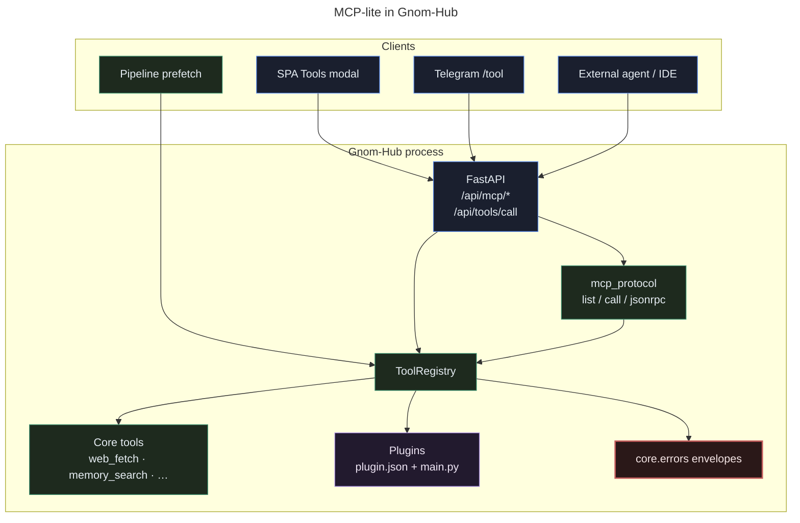
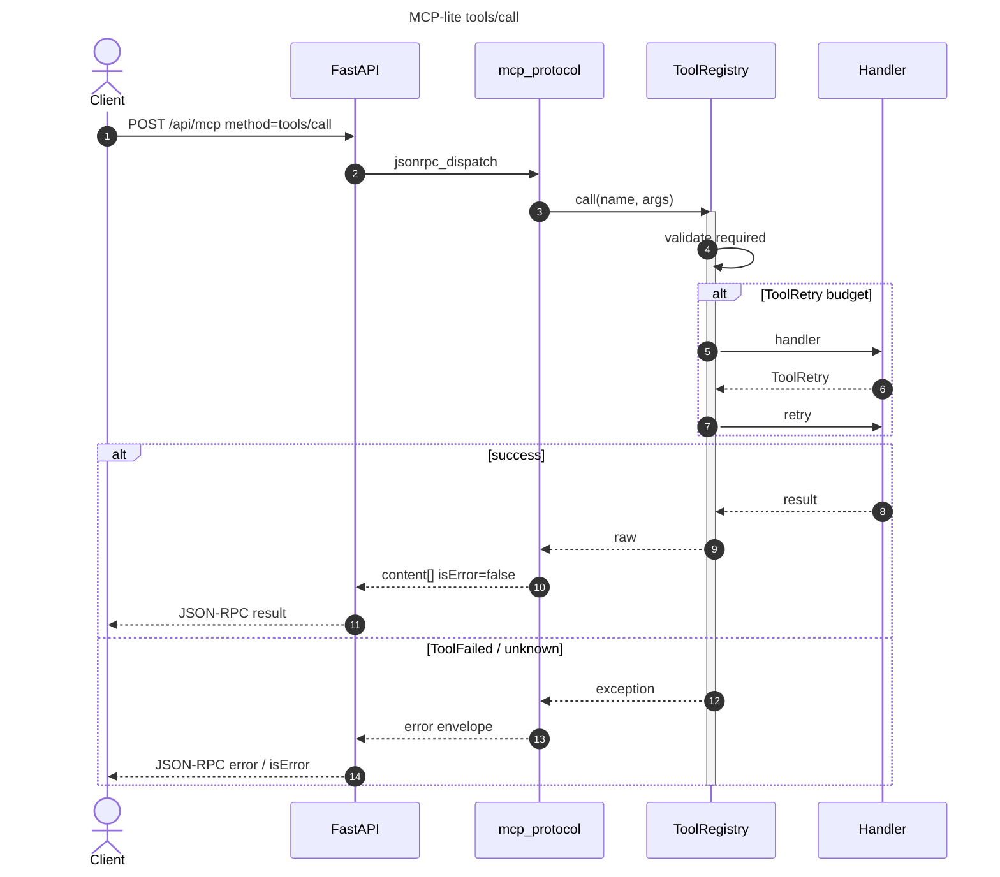

# MCP Server Architecture (Gnom-Hub)

How Gnom-Hub exposes tools in a **Model Context Protocol–compatible** shape — today as **MCP-lite** inside the FastAPI hub, with a clear path to a full stdio MCP server later.

**No Docker.** Runtime stays `.venv` + `./scripts/start.sh`.

---

## What exists today (MCP-lite)

| Surface | Role |
|---------|------|
| `ToolRegistry` | Single source of truth (core + plugins) |
| `GET /api/mcp/tools` | MCP **tools/list** body (`name`, `description`, `inputSchema`) |
| `POST /api/mcp/call` | MCP **tools/call**-shaped result (`content[]`, `isError`) |
| `POST /api/mcp` | Minimal **JSON-RPC 2.0** (`tools/list`, `tools/call`, `initialize`, `ping`) |
| `POST /api/tools/call` | Hub-native call (envelope errors) — same handlers |

Code: [`plugins/registry.py`](../src/gnom_hub/plugins/registry.py) · [`plugins/mcp_protocol.py`](../src/gnom_hub/plugins/mcp_protocol.py) · [`api/app.py`](../src/gnom_hub/api/app.py)

This is **not** yet a full MCP transport (stdio / SSE / OAuth). Clients talk HTTP to the hub.

---

## System context



---

## Layers

```text
┌─────────────────────────────────────────────────────────┐
│  Transport (future: stdio MCP / SSE)                    │  optional
├─────────────────────────────────────────────────────────┤
│  Protocol adapters                                      │
│    mcp_protocol.tools_list / tools_call / jsonrpc       │  MCP-lite
│    POST /api/tools/call  (hub-native)                   │
├─────────────────────────────────────────────────────────┤
│  ToolRegistry                                           │
│    validate required args · ToolRetry budget            │
│    ToolFailed → error envelope                          │
├─────────────────────────────────────────────────────────┤
│  Handlers                                               │
│    core tools (tools_ops) · plugin main.py              │
│    computer-use (God-Mode gate)                         │
└─────────────────────────────────────────────────────────┘
```

| Layer | Owns | Must not |
|-------|------|----------|
| Transport | framing, sessions | business logic |
| Protocol | MCP JSON shapes | OS secrets |
| Registry | names, schema, retries | LLM prompts |
| Handlers | side effects | invent HTTP status |

---

## Sequence: tools/call



---

## JSON shapes

### tools/list (`GET /api/mcp/tools`)

```json
{
  "tools": [
    {
      "name": "web_fetch",
      "description": "…",
      "inputSchema": {
        "type": "object",
        "properties": { "url": { "type": "string" } },
        "required": ["url"]
      }
    }
  ]
}
```

### tools/call (`POST /api/mcp/call`)

```json
{
  "ok": true,
  "isError": false,
  "content": [{ "type": "text", "text": "…" }],
  "result": { }
}
```

### JSON-RPC (`POST /api/mcp`)

```json
{
  "jsonrpc": "2.0",
  "id": 1,
  "method": "tools/call",
  "params": { "name": "hub_status", "arguments": {} }
}
```

Supported methods: `initialize` · `tools/list` · `tools/call` · `ping`.

---

## Plugins vs “skills”

| Concept | In Gnom-Hub | MCP mapping |
|---------|-------------|-------------|
| **Tool** | `ToolSpec` in registry | MCP tool |
| **Plugin** | folder `plugins/<id>/plugin.json` + `main.py` | registers 1..n tools |
| **Skill** (product language) | wish/preset/prompt packs — not a separate runtime | may *use* tools, not replace them |
| **Core tool** | `plugin="core"`, protected from overwrite | always listed |

Plugin load path: `PluginLoader` → validate manifest → `register(ToolSpec)` → visible in `tools/list`.

---

## Security model

| Gate | Effect |
|------|--------|
| Local desk trust | `main.py` runs in-process — only trusted plugins |
| Core protect | plugins cannot overwrite `plugin="core"` tools |
| God-Mode | computer-use real I/O only when enabled |
| Error sanitize | no raw `sk-…` in MCP error text ([ERROR_HANDLING.md](ERROR_HANDLING.md)) |
| No Docker / no remote MCP auth yet | bind hub to localhost for untrusted networks |

---

## Path to a full MCP server (optional)

```text
Phase A (now)     HTTP MCP-lite on same port as hub
Phase B           scripts/mcp_stdio.py → stdin JSON-RPC → ToolRegistry
Phase C           SSE transport + session ids (if multi-client)
Phase D           OAuth / remote — only if product requires it
```

Phase B sketch (not required for V1):

```text
while read line:
  req = json.loads(line)
  write json.dumps(jsonrpc_dispatch(registry, req))
```

Reuse **only** `mcp_protocol` + hub registry — do not fork tool handlers.

---

## Relation to pipeline

```text
Execute → worker_prefetch → registry.call(web_fetch|memory_search|install_tool)
        → pipeline.tool_calls[] → UI Tools history
```

Prefetch does **not** go through JSON-RPC; it calls the registry directly (same handlers, lower overhead).

---

## Checklist for new MCP tools

1. Register via core `tools_ops` or a plugin `ToolSpec` with `input_schema.required`.  
2. Return `ok` dict or raise `ToolRetry` / `ToolFailed`.  
3. Appear in `GET /api/mcp/tools`.  
4. Call works via `POST /api/mcp/call` and hub Tools modal.  
5. Errors use envelopes — no secrets.  
6. Document tag (`hub`, `memory`, …) if filterable.

---

## See also

| Doc | Topic |
|-----|--------|
| [ERROR_HANDLING.md](ERROR_HANDLING.md) | Tool failure envelopes |
| [PLUGIN_SECURITY.md](PLUGIN_SECURITY.md) | Plugin trust |
| [ARCHITECTURE.md](ARCHITECTURE.md) | Full hub map |
| [MERMAID.md](MERMAID.md) | Diagram conventions |
