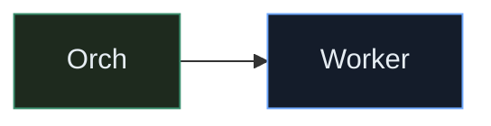
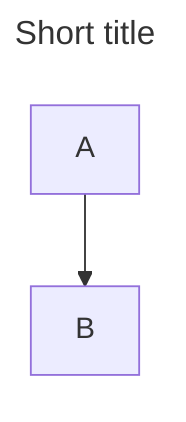
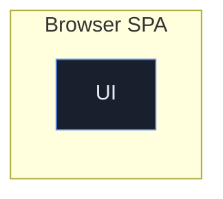
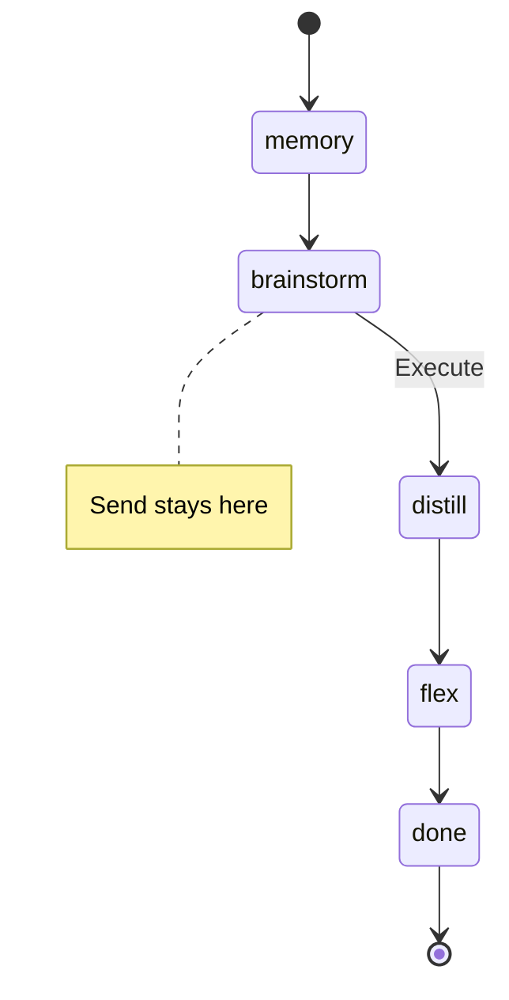
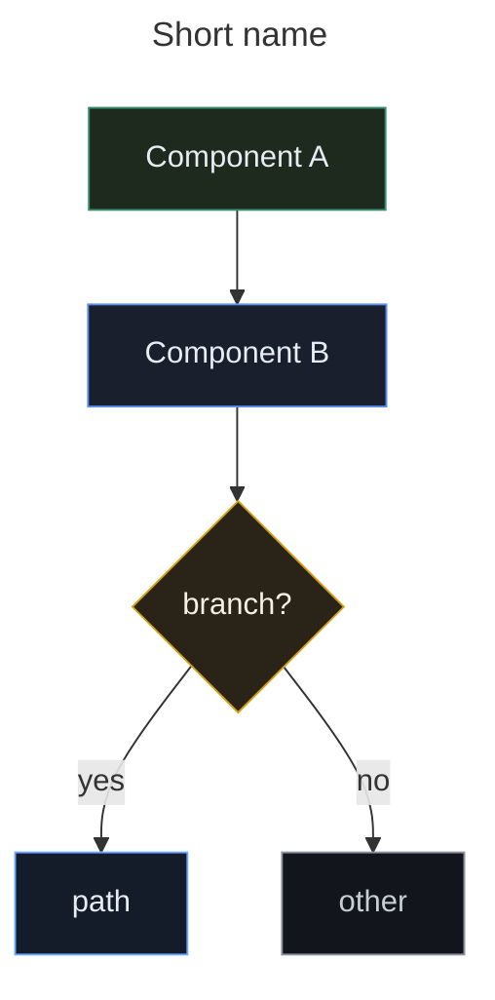

# Mermaid in Gnom-Hub docs

How we draw architecture diagrams so they render on **GitHub** and stay maintainable.

## Where diagrams live

| File | Content |
|------|---------|
| [README.md](../README.md) / [README_DE.md](../README_DE.md) | Product-facing overview |
| [ARCHITECTURE.md](ARCHITECTURE.md) | Full system map + execute sequence |
| This file | Syntax + **styling classes** |

---

## Shared styling classes (source of truth)

Use **only** these `classDef` names across README / ARCHITECTURE. Same hex values everywhere so dark GitHub UI stays readable.

### Palette

| Class | Role | Fill | Stroke | Text |
|-------|------|------|--------|------|
| `ui` | Browser SPA, REST, badges, API edge | `#1a1f2e` | `#5b8def` | `#e6edf3` |
| `core` | Orchestrator, agents, LLM, tools, registry | `#1e2a1e` | `#3a8f6e` | `#e6edf3` |
| `locked` | Memory / Flex (non-toggleable) | `#2a2218` | `#c9a227` | `#f5f0e6` |
| `work` | Workers W1–W4 | `#141c2a` | `#6ea8fe` | `#e6edf3` |
| `hot` | HOT session memory | `#2a2218` | `#c9a227` | `#f5f0e6` |
| `warm` | WARM durable / Flex wishes | `#1e2a1e` | `#3a8f6e` | `#e6edf3` |
| `cold` | COLD archive | `#1a1f2e` | `#6b7280` | `#c9cdd4` |
| `store` | Vector / SQLite-like stores | `#1a2433` | `#7c9cbf` | `#e6edf3` |
| `plugin` | Plugin packs | `#221a2e` | `#9b7ed9` | `#efe6f5` |
| `danger` | God-Mode / elevated risk | `#2a1818` | `#c45c5c` | `#f5e6e6` |
| `gate` | Decisions / clarify / quality branch | `#2a2418` | `#d4a017` | `#f5f0e6` |
| `terminal` | Pipeline start/end | `#12151c` | `#8b929e` | `#c9cdd4` |

### Canonical `classDef` block (copy into every styled diagram)

```text
classDef ui fill:#1a1f2e,stroke:#5b8def,color:#e6edf3,stroke-width:1px
classDef core fill:#1e2a1e,stroke:#3a8f6e,color:#e6edf3,stroke-width:1px
classDef locked fill:#2a2218,stroke:#c9a227,color:#f5f0e6,stroke-width:2px
classDef work fill:#141c2a,stroke:#6ea8fe,color:#e6edf3,stroke-width:1px
classDef hot fill:#2a2218,stroke:#c9a227,color:#f5f0e6,stroke-width:1px
classDef warm fill:#1e2a1e,stroke:#3a8f6e,color:#e6edf3,stroke-width:1px
classDef cold fill:#1a1f2e,stroke:#6b7280,color:#c9cdd4,stroke-width:1px
classDef store fill:#1a2433,stroke:#7c9cbf,color:#e6edf3,stroke-width:1px
classDef plugin fill:#221a2e,stroke:#9b7ed9,color:#efe6f5,stroke-width:1px
classDef danger fill:#2a1818,stroke:#c45c5c,color:#f5e6e6,stroke-width:2px
classDef gate fill:#2a2418,stroke:#d4a017,color:#f5f0e6,stroke-width:1px
classDef terminal fill:#12151c,stroke:#8b929e,color:#c9cdd4,stroke-width:1px
```

**Do not invent** one-off colors (`edge`, `reg`, …). Map them:

| Old / wrong | Use instead |
|-------------|-------------|
| `edge` | `ui` |
| `reg` | `core` |
| random purple for tools | `core` or `plugin` |

### Applying classes (two equivalent forms)

**A — `class` statement (batch):**



**B — `:::` shorthand (per node, preferred for small graphs):**


Rules:

1. Define `classDef` **after** nodes (or at end of diagram) — GH Mermaid is happiest that way.
2. Multiple classes on one node are **not** reliable on GitHub → one class per node.
3. Subgraphs **cannot** take `classDef` reliably → style **nodes inside**, not the subgraph frame.
4. Meaning must survive without color (labels + structure first).
5. `stroke-width:2px` only for **locked** and **danger** (attention).

### Optional edge styling

GitHub support is uneven; use sparingly:

```text
linkStyle default stroke:#4b5563,stroke-width:1px
linkStyle 0 stroke:#3a8f6e,stroke-width:2px
```

`linkStyle N` indexes edges in **declaration order** (0-based). Prefer labeled edges over colored ones.

### Sequence diagrams

`classDef` does **not** apply to sequence participants. Use:

- `rect rgb(30, 42, 30)` — core / prefetch zone (greenish)
- `rect rgb(42, 24, 24)` — danger / auth fail
- `rect rgb(26, 31, 46)` — UI / API note

### State diagrams

Limited styling. Prefer notes + clear transition labels over `classDef`.

---

## Diagram types we use

| Type | Keyword | Use for |
|------|---------|---------|
| Flowchart | `flowchart TB` / `LR` | Runtime, memory, tools |
| State machine | `stateDiagram-v2` | Pipeline stages |
| Sequence | `sequenceDiagram` | Execute path over time |

Avoid: `gitGraph`, `journey`, `gantt`, `pie`, `mindmap`, click handlers, heavy `init` themes.

## Frontmatter (optional)



## Flowchart building blocks

### Directions & subgraphs



- Subgraph: `subgraph Id["Label"]`
- `direction TB|LR` inside subgraph when layout fights you

### Node shapes

| Shape | Syntax | Use |
|-------|--------|-----|
| Rectangle | `A["text"]` | Component / stage |
| Stadium | `A(["pill"])` | Entry/exit · `terminal` |
| Circle | `A((EventBus))` | Bus |
| Diamond | `A{decision?}` | Branch · `gate` |
| Cylinder | `A[("store")]` | Vector / DB · `store` |
| Subroutine | `A[["Registry"]]` | Registry facade · `core` |

### Edges

```text
A --> B
A -.-> B
A <-.-> B
A -->|"label"| B
A & B --> C
```

### Line breaks

Use `<br/>`, never `\n`:

```text
LLM["LLM manager<br/>DeepSeek / Ollama"]:::core
```

## State diagrams



## Sequence diagrams

```mermaid
sequenceDiagram
  autonumber
  participant U as User
  participant O as Orchestrator
  U->>O: Execute
  rect rgb(30, 42, 30)
    Note over O: core path
    O->>O: distill
  end
  alt fixable
    O->>O: retry
  else auth fail
    O-->>U: FEHLER
  end
```



## Checklist before commit

1. Only **shared class names** from the palette above.
2. `classDef` includes `stroke-width`.
3. Fence balanced; labels use `<br/>`.
4. EN/DE README stay parallel (same classes, translated labels).
5. Diagram readable without color.
6. No `edge` / `reg` aliases — use `ui` / `core`.

## Common failures

| Symptom | Fix |
|---------|-----|
| Style ignored | `classDef` after nodes; one class per node |
| Wrong colors | Copied old `edge`/`reg` — remap to palette |
| Blank diagram | Unbalanced fence or bad frontmatter |
| Edge `linkStyle` paints wrong line | Edge index off-by-one — drop linkStyle |

## Minimal styled template

````markdown

````
