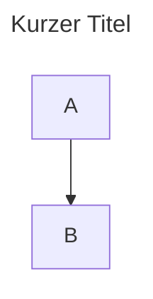
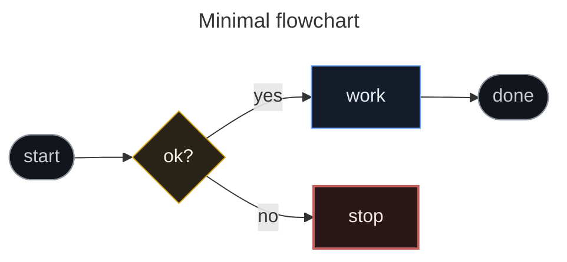
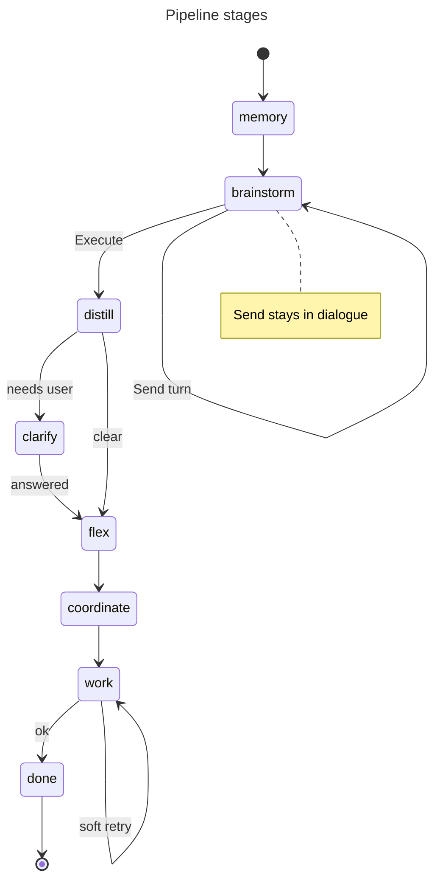
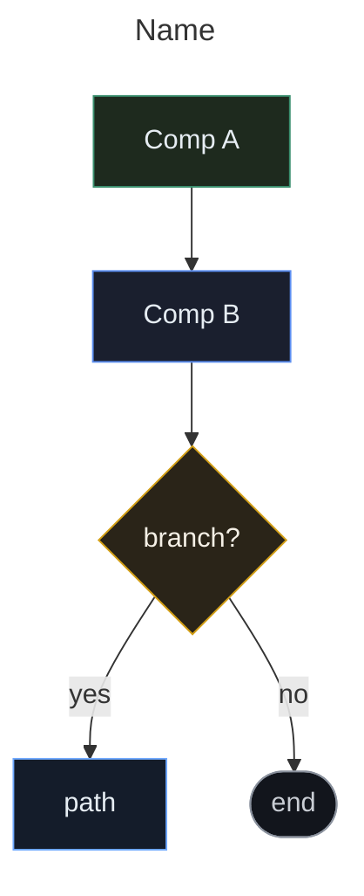
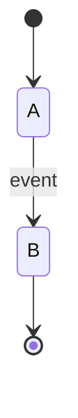

```mermaid
sequenceDiagram
  autonumber
  actor U as User
  participant O as Orchestrator
  U->>O: request
  activate O
  rect rgb(30, 42, 30)
    O->>O: work
  end
  O-->>U: response
  deactivate O
```

# Mermaid — Syntax-Referenz (Gnom-Hub)

Technische Referenz für Diagramme in diesem Repo.  
Render-Ziel: **GitHub** (CommonMark + Mermaid).  
Beispiele im Einsatz: [ARCHITECTURE.md](ARCHITECTURE.md) · [README.md](../README.md) · [README_DE.md](../README_DE.md).

---

## Inhalt

1. [Grundgerüst](#1-grundgerüst)
2. [flowchart](#2-flowchart)
3. [stateDiagram-v2](#3-statediagram-v2)
4. [sequenceDiagram](#4-sequencediagram)
5. [Styling-Klassen (Gnom-Palette)](#5-styling-klassen-gnom-palette)
6. [GitHub-Grenzen](#6-github-grenzen)
7. [Checkliste](#7-checkliste)
8. [Schnell-Templates](#8-schnell-templates)

---

## 1. Grundgerüst

### Fence

````markdown

````

- Sprache im Info-String: genau `mermaid`
- Fence-Paare immer **gerade** (keine verschachtelten ` ``` ` im Diagramm)

### Frontmatter (optional, modern Mermaid)



| Key | Bedeutung |
|-----|-----------|
| `title` | Überschrift über dem Graph |
| `config.flowchart.curve` | Kanten: `basis` · `linear` · `step` · `stepBefore` · `stepAfter` |
| `config.flowchart.padding` | Innenabstand (Zahl) |

Wenn GH blank bleibt: Frontmatter entfernen und nur den Diagramm-Body testen.

### Diagrammtypen in diesem Repo

| Typ | Startzeile | Einsatz |
|-----|------------|---------|
| Flowchart | `flowchart TB` / `LR` / `BT` / `RL` | Runtime, Memory, Tools |
| State | `stateDiagram-v2` | Pipeline-Stages |
| Sequence | `sequenceDiagram` | Send · Execute · Tools API |

**Nicht** nutzen (schlechtes GH-Support / unnötig): `graph` (legacy), `gitGraph`, `gantt`, `pie`, `journey`, `mindmap`, `timeline`, `C4Context`, `click`, `init` mit Themes.

---

## 2. flowchart

### Richtung

```text
flowchart TB   %% top → bottom  (default in docs)
flowchart TD   %% alias für TB
flowchart BT   %% bottom → top
flowchart LR   %% left → right
flowchart RL   %% right → left
```

Innerhalb eines Subgraphs:

```text
subgraph Client["Browser SPA"]
  direction TB
  UI --> Badges
end
```

### Subgraphs

```text
subgraph Id["Label mit Leerzeichen"]
  ...
end
```

- **Id** ohne Leerzeichen; **Label** in Anführungszeichen
- Nested subgraphs ok, Layout kann auf GH eng werden → flach halten

### Node-Syntax

| Form | Syntax | Bedeutung bei uns |
|------|--------|-------------------|
| Rechteck | `A[Text]` / `A["Text"]` | Komponente, Stage |
| Rund / Stadium | `A(Text)` / `A([Text])` | Terminal start/end |
| Kreis | `A((Text))` | EventBus |
| Raute | `A{Text?}` | Entscheidung (`gate`) |
| Hexagon | `A{{Text}}` | Config (selten) |
| Parallelogramm | `A[/Text/]` · `A[\Text\]` | I/O (selten) |
| Cylinder | `A[(Text)]` / `A[("Store")]` | Vector / DB (`store`) |
| Subroutine | `A[[Text]]` | Registry-Fassade (`core`) |
| Asymmetrisch | `A>Text]` | selten |

**Labels mit Sonderzeichen / Leerzeichen** immer quoten:

```text
A["LLM manager<br/>DeepSeek"]
```

### Zeilenumbruch im Label

| ✅ | ❌ |
|----|----|
| `<br/>` oder `<br>` | `\n` (unzuverlässig auf GH) |

### Kanten (Edges)

```text
A --> B              %% Pfeil
A --- B              %% Linie ohne Pfeil
A -.-> B             %% gestrichelt
A ==> B              %% dick (Support variiert)
A -->|label| B       %% Label unquoted (einfach)
A -->|"label mit Space"| B
A -- text --> B      %% alternative Label-Form
A <-- B              %% rückwärts
A <--> B             %% bidirektional
A <-.-> B            %% bi + dashed
A & B --> C          %% Multi-Source (Mermaid ≥9)
```

Kommentare: `%% dies ist ein Kommentar`

### Styling am Node

```text
A["Orch"]:::core
class A core
class A,B,C core
```

Siehe [§5](#5-styling-klassen-gnom-palette).

### linkStyle (Kantenfarbe, sparsam)

```text
A --> B
B --> C
linkStyle default stroke:#4b5563,stroke-width:1px
linkStyle 0 stroke:#3a8f6e,stroke-width:2px
```

Index = **Reihenfolge der Edge-Deklarationen** (0-based). Leicht falsch → lieber weglassen.

### Minimales Flowchart-Beispiel



---

## 3. stateDiagram-v2

```text
stateDiagram-v2
  [*] --> memory
  memory --> brainstorm
  brainstorm --> distill: Execute
  brainstorm --> brainstorm: Send turn
  distill --> flex
  flex --> done
  done --> [*]
```

### Bausteine

| Syntax | Bedeutung |
|--------|-----------|
| `[*]` | Start / Ende |
| `A --> B` | Transition |
| `A --> B: label` | Transition mit Label |
| `state "Name" as S` | Alias |
| `state S { ... }` | Composite state |
| `note right of A: text` | Einzeilige Note |
| `note right of A` … `end note` | Mehrzeilige Note |

### Pipeline-Beispiel (Gnom)



`classDef` auf States ist auf GH **unzuverlässig** → Struktur + Notes statt Farben.

---

## 4. sequenceDiagram

```text
sequenceDiagram
  autonumber
  actor U as User
  participant O as Orchestrator
  U->>O: Execute
  O-->>U: result
```

### Teilnehmer

```text
actor U as User                 %% Mensch (Stick-Figur wo unterstützt)
participant SPA as SPA
participant API as FastAPI
participant O as Orchestrator
```

- Kurze **Id**, lesbares **Label**
- ≤ ~10 Participants pro Diagramm (sonst splitten: Send / Execute / Tools)

### Nachrichten

| Syntax | Bedeutung |
|--------|-----------|
| `A->>B: msg` | Sync-Request (durchgezogener Pfeil) |
| `A-->>B: msg` | Response / gestrichelter Pfeil |
| `A-)B: msg` | Async open (selten) |
| `A--)B: msg` | Async dotted (selten) |
| `A->>+B: msg` | Request + activate B |
| `A-->>-B: msg` | Response + deactivate B |

### Activation (explizit)

```text
activate O
O->>W: run
deactivate O
```

Jedes `activate` braucht ein `deactivate` (oder `+/-` an der Message).

### Kontrollblöcke (GH-tauglich)

```text
opt optional
  A->>B: maybe
end

alt Fall A
  A->>B: x
else Fall B
  A->>B: y
end

loop jeder Worker
  O->>W: run
end
```

| Block | Bei Gnom |
|-------|----------|
| `opt` | Prefetch-URL, optional Tool, auto-Execute |
| `alt` / `else` | Key ok vs. FEHLER; fixable vs. auth |
| `loop` | Worker, Soft-Retries |
| `par` | **vermeiden** (Worker laufen sequentiell) |
| `critical` / `break` | **vermeiden** (GH unzuverlässig) |

### Notes & rect

```text
Note over O,T: core · prefetch
Note left of U: sieht Box 3
Note right of F: locked wishes

rect rgb(30, 42, 30)
  Note over O: core zone
  O->>O: distill
end
```

#### rect-Farben (= Flowchart-Palette)

| `rgb(...)` | Token | Einsatz |
|------------|-------|---------|
| `rgb(26, 31, 46)` | **ui** | SPA · REST · Modal |
| `rgb(30, 42, 30)` | **core** | Orch · Distill · Prefetch |
| `rgb(42, 34, 24)` | **locked / hot** | Flex · Memory-Wishes |
| `rgb(34, 26, 46)` | **plugin** | Plugin-Handler |
| `rgb(42, 24, 24)` | **danger** | Auth-FEHLER · kein Stub |

`classDef` gilt **nicht** für Sequence-Participants.

### Minimales Sequence-Beispiel

```mermaid
---
title: Execute skeleton
---
sequenceDiagram
  autonumber
  actor U as User
  participant O as Orchestrator
  participant W as Worker
  participant L as LLM

  U->>O: Execute
  activate O
  rect rgb(30, 42, 30)
    Note over O: core · plan
    O->>O: plan
  end
  alt usable key
    O->>W: run
    W->>L: chat
    L-->>W: draft
    W-->>O: draft
  else auth fail
    rect rgb(42, 24, 24)
      Note over W,U: danger · FEHLER
      W-->>O: FEHLER
      O-->>U: no stub
    end
  end
  deactivate O
```



Volle Diagramme: [ARCHITECTURE.md — Paths over time](ARCHITECTURE.md#paths-over-time-sequence).

---

## 5. Styling-Klassen (Gnom-Palette)

Nur diese Namen — überall gleich (dark GH UI).

### Palette

| Class | Rolle | Fill | Stroke | Text | Width |
|-------|-------|------|--------|------|-------|
| `ui` | SPA, REST, Badges | `#1a1f2e` | `#5b8def` | `#e6edf3` | 1px |
| `core` | Orch, Agents, LLM, Registry | `#1e2a1e` | `#3a8f6e` | `#e6edf3` | 1px |
| `locked` | Memory / Flex (fix) | `#2a2218` | `#c9a227` | `#f5f0e6` | **2px** |
| `work` | Worker W1–W4 | `#141c2a` | `#6ea8fe` | `#e6edf3` | 1px |
| `hot` | HOT Session | `#2a2218` | `#c9a227` | `#f5f0e6` | 1px |
| `warm` | WARM / Flex-Wishes | `#1e2a1e` | `#3a8f6e` | `#e6edf3` | 1px |
| `cold` | COLD Archiv | `#1a1f2e` | `#6b7280` | `#c9cdd4` | 1px |
| `store` | Vector / Workspace | `#1a2433` | `#7c9cbf` | `#e6edf3` | 1px |
| `plugin` | Plugin-Packs | `#221a2e` | `#9b7ed9` | `#efe6f5` | 1px |
| `danger` | God-Mode / FEHLER | `#2a1818` | `#c45c5c` | `#f5e6e6` | **2px** |
| `gate` | Clarify / Branch | `#2a2418` | `#d4a017` | `#f5f0e6` | 1px |
| `terminal` | Start / Ende | `#12151c` | `#8b929e` | `#c9cdd4` | 1px |

### Canonical `classDef`-Block

```text
classDef ui fill:#1a1f2e,stroke:#5b8def,color:#e6edf3,stroke-width:1px
classDef core fill:#1e2a1e,stroke:#3a8f6e,color:#e6edf3,stroke-width:1px
classDef locked fill:#2a2218,stroke:#c9a227,color:#f5f0e6,stroke-width:2px
classDef work fill:#141c2a,stroke:#6ea8fe,color:#e6edf3,stroke-width:1px
classDef hot fill:#2a2218,stroke:#c9a227,color:#f5f0e6,stroke-width:1px
classDef warm fill:#1e2a1e,stroke:#3a8f6e,color:#e6edf3,stroke-width:1px
classDef cold fill:#1a1f2e,stroke:#6b7280,color:#c9cdd4,stroke-width:1px
classDef store fill:#1a2433,stroke:#7c9cbf,color:#e6edf3,stroke-width:1px
classDef plugin fill:#221a2e,stroke:#9b7ed9,color:#efe6f5,stroke-width:1px
classDef danger fill:#2a1818,stroke:#c45c5c,color:#f5e6e6,stroke-width:2px
classDef gate fill:#2a2418,stroke:#d4a017,color:#f5f0e6,stroke-width:1px
classDef terminal fill:#12151c,stroke:#8b929e,color:#c9cdd4,stroke-width:1px
```

### Anwenden

```text
%% Variante A — shorthand (bevorzugt bei wenigen Nodes)
A["Orch"]:::core --> B["Worker"]:::work

%% Variante B — batch
class A core
class B,C work
```

Regeln:

1. `classDef` **am Ende** des Diagramms (oder nach den Nodes)
2. **Eine** Klasse pro Node (GH)
3. Subgraph-Frames **nicht** stylen — nur innere Nodes
4. Bedeutung muss **ohne Farbe** lesbar bleiben
5. Keine Aliase: nicht `edge` / `reg` → `ui` / `core`

---

## 6. GitHub-Grenzen

| Feature | Status auf GitHub |
|---------|-------------------|
| `flowchart` / `stateDiagram-v2` / `sequenceDiagram` | ✅ |
| `---` frontmatter title/config | ✅ meistens; bei Blank testweise weg |
| `classDef` + `:::` | ✅ |
| `<br/>` in Labels | ✅ |
| `\n` in Labels | ❌ unzuverlässig |
| `click` / Callbacks | ❌ |
| Fontawesome / Bilder in Nodes | ❌ / fragil |
| `par` / `critical` in Sequence | ⚠️ unzuverlässig |
| Sehr große Graphen | ⚠️ Layout bricht |

---

## 7. Checkliste

Vor Commit:

1. [ ] Fence ` ```mermaid ` … ` ``` ` balanciert  
2. [ ] Labels: `"…"` bei Spaces; Umbruch nur mit `<br/>`  
3. [ ] Nur Palette-Klassen aus §5  
4. [ ] `stroke-width` in jedem `classDef`  
5. [ ] Sequence: `activate`/`deactivate` gepaart; rect-Farben aus Tabelle  
6. [ ] EN/DE README parallel (gleiche Shapes, übersetzte Labels)  
7. [ ] Diagramm ohne Farbe noch verständlich  
8. [ ] Tiefe Sequenzen in ARCHITECTURE, README nur Overview  

---

## 8. Schnell-Templates

### Flowchart

````markdown

````

### State

````markdown

````

### Sequence

````markdown

````

---


---

## 9. Automatisierung

```bash
# Statische Prüfung aller ```mermaid```-Blöcke (README + docs/)
python scripts/mermaid_check.py
python scripts/mermaid_check.py --list
python scripts/mermaid_check.py --json
python scripts/mermaid_check.py --write-inventory docs/generated/mermaid_inventory.md

# Im Pre-Push-Gate (default an; aus: GNOM_PREPUSH_MERMAID=0)
./scripts/prepush_gate.sh
```

Der Checker erzwingt:

| Check | Level |
|-------|-------|
| Erlaubte Diagrammtypen | error |
| Palette-`classDef` / `:::` nur aus §5 | error |
| Gebannte Klassen (`edge`, `reg`) | error |
| `\n` in Labels | error |
| `click` / gantt / … | error |
| `activate`/`deactivate` Balance | warning |
| `stroke-width` in classDef | warning |

Inventory (generiert): [generated/mermaid_inventory.md](generated/mermaid_inventory.md).

### CI

GitHub Actions **lint** job runs the same gate as local:

```text
./scripts/prepush_gate.sh          # Ruff + mermaid_check
python scripts/mermaid_check.py --write-inventory …
git diff --exit-code docs/generated/mermaid_inventory.md
```

Workflow: [`.github/workflows/ci.yml`](../.github/workflows/ci.yml).

## Siehe auch

| Doc | Inhalt |
|-----|--------|
| [ARCHITECTURE.md](ARCHITECTURE.md) | Alle Produktions-Diagramme |
| [README.md](../README.md) / [README_DE.md](../README_DE.md) | Produkt-Overview-Diagramme |
| [Upstream Mermaid](https://mermaid.js.org/intro/) | Offizielle Syntax (über GH-Support hinaus) |

**Deutsch / English:** Diese Referenz ist zweisprachig nutzbar (Tabellen DE, Keywords EN wie in Mermaid). Produkttexte bleiben in den READMEs getrennt.
