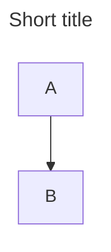
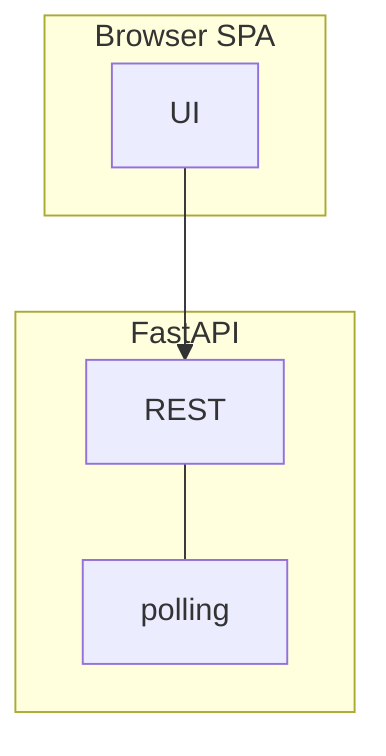
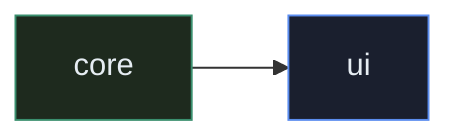
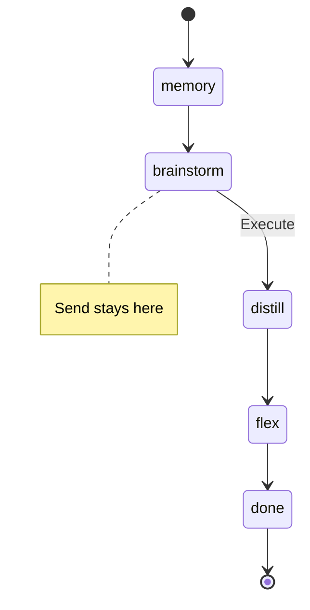
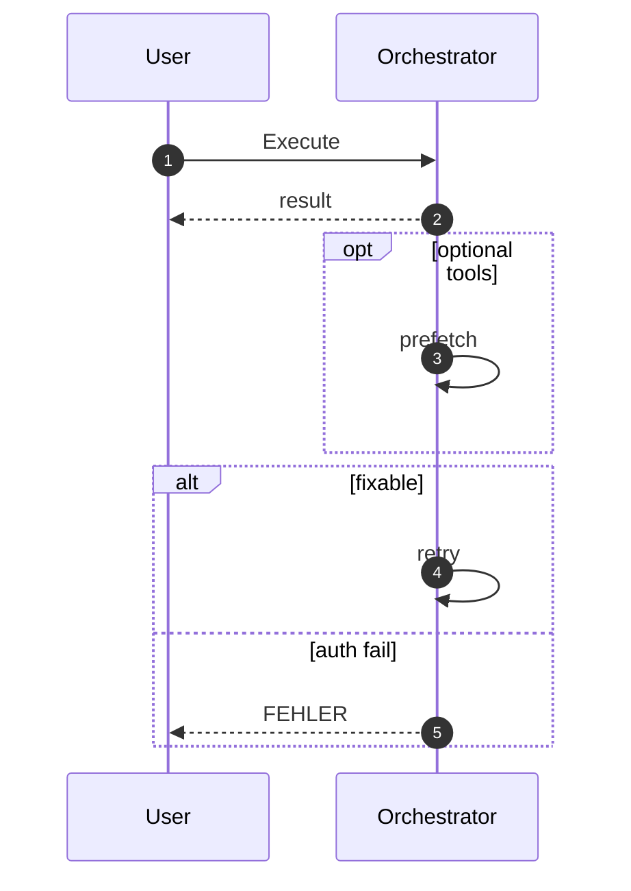
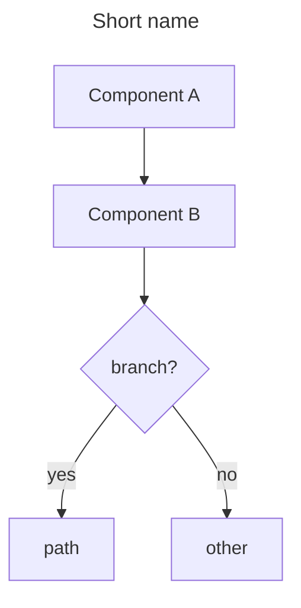

# Mermaid in Gnom-Hub docs

How we draw architecture diagrams so they render on **GitHub** and stay maintainable.

## Where diagrams live

| File | Content |
|------|---------|
| [README.md](../README.md) / [README_DE.md](../README_DE.md) | Product-facing overview |
| [ARCHITECTURE.md](ARCHITECTURE.md) | Full system map + execute sequence |
| This file | Syntax conventions |

## Diagram types we use

| Type | Keyword | Use for |
|------|---------|---------|
| Flowchart | `flowchart TB` / `LR` | Runtime, memory, tools |
| State machine | `stateDiagram-v2` | Pipeline stages |
| Sequence | `sequenceDiagram` | Execute path over time |

Avoid in this repo (poor GH support or noise): `gitGraph`, `journey`, `gantt`, `pie`, `mindmap`, click handlers, `init` themes that fight dark UI.

## Frontmatter (optional)



- `title` — shown above the graph on modern Mermaid
- `config.flowchart.curve` — edge style (`basis` / `linear` / `step`)

## Flowchart syntax we rely on

### Directions & subgraphs



- Always give subgraphs an **id** and a **label**: `subgraph Id["Label"]`
- `direction TB|LR` **inside** subgraph when layout fights you

### Node shapes

| Shape | Syntax | Meaning in our docs |
|-------|--------|---------------------|
| Rectangle | `A["text"]` | Component / stage |
| Round | `A(["start/end"])` | Terminal stage |
| Stadium | `A(["pill"])` | Entry/exit |
| Circle | `A((EventBus))` | Bus / bus-like |
| Diamond | `A{decision?}` | Branch |
| Cylinder | `A[("store")]` | Vector / DB-like |
| Subroutine | `A[["Registry"]]` | Facade / registry |
| Hexagon | `A{{config}}` | Rare — settings |

### Edges

```text
A --> B          solid arrow
A -.-> B         dashed (optional / soft link)
A <-- B          reverse
A <-.-> B        bidirectional dashed
A -->|"label"| B quoted edge label
A & B --> C      multi-source (Mermaid ≥9)
```

Prefer **quoted** edge labels when they contain spaces or punctuation: `|"promote"|`.

### Line breaks in labels

Use **HTML break**, not `\n`:

```text
LLM["LLM manager<br/>DeepSeek / Ollama"]
```

`\n` is unreliable across GitHub Mermaid versions.

### Styling (`classDef`)

GitHub supports limited CSS-like fills (dark-friendly defaults we use):



| Token | Role |
|-------|------|
| green stroke | core hub path |
| blue stroke | UI / API edge |
| gold stroke | locked agents (Flex/Memory) |
| red stroke | God-Mode / elevated risk |

Do **not** depend on styling for meaning — labels must stand alone if colors fail.

## State diagrams



- Transitions: `A --> B: label`
- Notes: `note right of State` … `end note` (multi-line) or one-liner `note right of State: text`

## Sequence diagrams



| Feature | Why |
|---------|-----|
| `autonumber` | Easier review of Execute path |
| `participant X as Label` | Short ids, readable labels |
| `rect rgb(r,g,b)` | Group prefetch / dangerous zones |
| `opt` / `alt` / `else` / `loop` | Real control flow |
| `Note over A,B: text` | Stage captions |

Solid `->>` request, dashed `-->>` response.

## Checklist before commit

1. Fence is exactly ` ```mermaid ` … ` ``` ` (balanced).
2. No unescaped `"` inside node labels — use `<br/>` and `·` separators.
3. Subgraph labels quoted if they contain spaces.
4. Diagram still readable as **structure** without colors.
5. EN and DE READMEs stay **parallel** (same shapes, translated labels).
6. Prefer editing [ARCHITECTURE.md](ARCHITECTURE.md) for deep diagrams; keep README overview lighter.

## Common failures

| Symptom | Fix |
|---------|-----|
| Diagram blank on GitHub | Unbalanced fence, or `config`/`title` unsupported — simplify frontmatter |
| Node text cut off | Shorter labels + `<br/>` |
| Subgraph collapsed wrong | Set `direction` inside subgraph |
| Edge label breaks parse | Use `|"label with spaces"|` |
| `\n` shows as garbage | Replace with `<br/>` |

## Minimal template (new diagram)

````markdown

````
