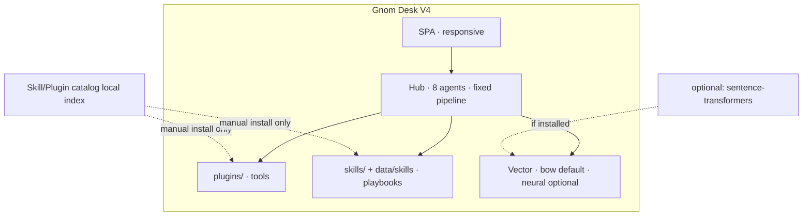

# V4 Plan — Skills, Marketplace, Neural Embeddings, Mobile UI

**Stand:** 2026-08-10 · Status: **Phase 0–4 implemented (3.10.0)** (no unfreeze until Phase 0 decision)  
**Basis:** V3.9.1 desk wave complete ([MERGE_STATUS.md](MERGE_STATUS.md))  
**Constraint map:** [HUB_ARCHITECTURE.md](HUB_ARCHITECTURE.md) · [WORKFLOWS_AND_PRESETS.md](WORKFLOWS_AND_PRESETS.md) · [PLUGIN_SECURITY.md](PLUGIN_SECURITY.md)

---

## 0. Warum überhaupt?

| Thema | Kurzantwort |
|-------|-------------|
| **Skills** | Ja — **wichtig**, aber *anders* als Plugins. Plugins = Code/Tools. Skills = **erlernte/kuratierte Spielbücher** (Wissen + Checklisten + DoD), die Agents *wie* arbeiten. Ohne Skills wächst nur Prompt-Chaos und du wiederholst dieselben Regeln manuell. |
| **Marketplace** | Cool, aber **gefährlich** als Core-Auto-Load (Trust = Hub-Prozess). Sinnvoll als **kuratierter Katalog + manuelle Installation** auf dem Drop-in-Pfad. |
| **Neural Embeddings** | Bessere Recall-Qualität für WARM/Vector, **optional** (schwere Deps). Core bleibt bow/char_ngram. |
| **Mobile UI** | Desk wird nutzbarer auf Phone/Tablet; **responsive SPA first**, keine native App in V4. |

### Skills vs Plugins vs Presets (klar trennen)

```
┌─────────────────┬──────────────────────┬─────────────────────────────┐
│                 │ Was es ist           │ Was es NICHT ist            │
├─────────────────┼──────────────────────┼─────────────────────────────┤
│ Plugin          │ Ausführbarer Tool-   │ Kein Pipeline-Graph         │
│                 │ Code (main.py)       │                             │
├─────────────────┼──────────────────────┼─────────────────────────────┤
│ Skill           │ Markdown-Playbook +  │ Kein Workflow-Engine,       │
│                 │ Frontmatter (Prompt  │ kein zweiter Orchestrator,  │
│                 │ inject / DoD / tags) │ kein auto-Execute           │
├─────────────────┼──────────────────────┼─────────────────────────────┤
│ Team/Worker     │ Tuning-Snapshot      │ Kein Skill-Inhalt           │
│ Preset          │ (wer an, temp, …)    │                             │
├─────────────────┼──────────────────────┼─────────────────────────────┤
│ plan_mode       │ Coordinator-Strategie│ Kein Skill-Markt            │
└─────────────────┴──────────────────────┴─────────────────────────────┘
```

**Freeze heute:** [WORKFLOWS_AND_PRESETS.md](WORKFLOWS_AND_PRESETS.md) sagt *„No skill files. No graph.“*  
Das meinte: **keine Workflow-Rezepte / Graph-Engine.**  
V4-Skills sind **Playbooks**, keine Graphen — aber der Freeze-Text muss **explizit umgeschrieben** werden (Phase 0), sonst bauen wir gegen die Doku.

### „Erlernte Skills“ (dein Punkt)

Drei Stufen, bewusst getrennt:

| Stufe | Name | Quelle | Persistenz |
|-------|------|--------|------------|
| **S0** | Seed skills | Repo `skills/_bundled/*` (kuratiert) | git |
| **S1** | User skills | `data/skills/user/*` drop-in | USB / data |
| **S2** | Learned hints | Nach gutem Execute: kurze DoD/Rules → Vorschlag speichern | WARM fact *oder* Skill-Draft (User bestätigt) |

**Wichtig:** S2 **auto-schreibt nie** ausführbaren Code und **auto-installiert nie** Remote-Packs. Nur Text-Playbooks + Bestätigung.

---

## 1. Zielbild V4 (eine Seite)



**Nicht im Zielbild:** zweiter Orchestrator, Auto-Execute, untrusted remote `import`, Workflow-Graph-JSON.

---

## 2. Phasen (Reihenfolge = sinnvoll & sicher)

### Phase 0 — Decision & Freeze-Update *(1 PR, docs only)*

**Warum zuerst:** Skills ohne Freeze-Klärung = Doku-Konflikt und Scope-Creep.

| Entscheidung | Vorschlag |
|--------------|-----------|
| Skills erlaubt? | **Ja**, als Playbooks only |
| Marketplace Core? | **Nein** — nur lokaler Katalog + manuelles Drop-in |
| Neural in Core? | **Nein** — optional plugin/extra |
| Mobile | Responsive SPA, breakpoint ~390px |

**Deliverables:**
- Dieser Plan (`V4_PLAN.md`) ✅
- Patch [WORKFLOWS_AND_PRESETS.md](WORKFLOWS_AND_PRESETS.md): „No skill *workflow files*“ → „Playbook skills OK; no graph“
- ROADMAP Abschnitt **V4.x** anlegen

**Exit:** Explizite Ja/Nein im Chat oder „bau Phase 1“.

---

### Phase 1 — Local Skills foundation *(klein, KISS)*

**Warum:** Höchster Nutzen pro Risiko. Keine Remote, kein Code-Exec aus Skills.

**Modell:**
```yaml
# skills/html_landing/skill.md frontmatter
id: html_landing
name: Single-file HTML landing
version: 0.1.0
enabled: true
tags: [html, frontend]
agents: [coordinator, worker1, brainstorm]   # optional filter
triggers:                                    # soft hints, not routing engine
  - full_page_html
  - html_page
```

Body = Markdown instructions (DoD, anti-patterns, structure).

**Code (minimal):**
| Piece | Responsibility |
|-------|----------------|
| `src/gnom_hub/skills/loader.py` | Scan `skills/` + `data/skills/`; parse frontmatter; no exec |
| `SkillRegistry` | list / get / match by tag or plan_mode |
| Inject | Coordinator + Worker system prompt: append ≤N chars matched skills |
| API | `GET /api/skills`, `POST /api/skills/reload` |
| UI | Tools-ähnliches Modal oder Tab „Skills“ (list + enable) |

**Bundled seeds (2–4):**
1. `html_landing` — single-file page DoD (aligns with scoring fast path)
2. `tool_drill_honest` — never invent tool results
3. `de_desk` — German desk language / Flex wishes
4. optional `qa_checklist`

**Tests:** load/parse, inject only when trigger matches, disabled skill skipped, garbage size cap.

**Nicht in Phase 1:** Remote download, signing, learned auto-save, marketplace UI.

---

### Phase 2 — Skill Marketplace (local catalog, trust-first)

**Warum interessant:** Skills teilen, USB-Desk erweitern — **ohne** App-Store-Risiko.

| Layer | Was |
|-------|-----|
| **Catalog** | `docs/skills_catalog.json` oder `data/skills/catalog.json` — id, name, version, hash, source path/url, trust:bundled\|local\|reviewed |
| **Install** | Copy zip/folder → `data/skills/user/<id>/` · **no auto import of .py** from skill packs |
| **UI** | Catalog list · Install from path · Enable/Disable · Show trust badge |
| **Telegram** | `/skills` list · optional `/skill_enable id` |

**Hard rules:**
1. Skill pack **darf kein `main.py` ausführen**. Code = Plugin-Pfad, nicht Skill-Pfad.
2. Remote URL install nur mit **explizitem** User-Confirm + checksum.
3. Kein auto-enable nach install.

**Später (2b, optional):** signed manifests, GitHub raw mirror, „Gnom skill packs“ repo — immer noch manuell.

---

### Phase 3 — Neural Embeddings (optional implant)

**Warum:** Bessere semantische Recall für Wünsche/Facts; bow bleibt Default für USB/offline/CI.

| Piece | Detail |
|-------|--------|
| Extra | `pip install gnom-hub[embeddings]` → `sentence-transformers` *oder* smaller `fastembed` |
| Plugin | `plugins/embeddings_neural/` — `on_load` only if import works |
| Backend | `VectorStore.set_embedder("sbert", fn=..., reindex=False)` default; reindex explicit |
| Env | `GNOM_EMBEDDINGS=sbert` · model name env |
| Desk | Vector modal: backend `sbert` appears only if available |
| Fallback | Import fail → stay bow, toast once |

**Risk control:**
- Model download size (USB!) → document “first run downloads ~XX MB”
- Prefer small model (`all-MiniLM-L6-v2` class) or ONNX fastembed
- Rank-eval gold set: **bow remains CI gate**; separate optional eval for sbert

**Nicht:** neural as default, hard dep in `pyproject` main deps.

---

### Phase 4 — Mobile UI (responsive desk)

**Warum:** Desk auf Phone checken / Brainstorm unterwegs — ohne native App.

| Priority | Work |
|----------|------|
| P0 | Layout: no horizontal overflow @ 390px; 3 boxes stack or tab switch |
| P1 | Touch targets ≥44px; agent row scroll; modals full-sheet |
| P2 | Sticky chat send; Execute reachable; Vector/Tools usable |
| P3 | Optional: `?compact=1` density, safe-area insets |

**Out of scope V4:** PWA install mandatory, offline SW, iOS native shell.

**Verify:** Playwright viewport 390×844 smoke (no keys needed for chrome-only).

---

## 3. Was wir *nicht* bauen (explizit)

| Idee | Warum raus |
|------|------------|
| Skills steuern Pipeline-Stages | zweiter Orchestrator / Freeze |
| Marketplace auto-exec Python | Security = Hub-Prozess |
| Neural default | USB + CI + no network |
| Skill = Plugin hybrid zip | Trust-Grenze verwischt |
| Multi-user cloud market | V1 local desk |

---

## 4. Reihenfolge & Aufwand (grob)

| Phase | Nutzen | Risiko | Aufwand | Abhängigkeit |
|-------|--------|--------|---------|--------------|
| **0 Docs/Freeze** | Klarheit | niedrig | XS | — |
| **1 Local Skills** | hoch (wiederholbare Qualität) | niedrig | S–M | Phase 0 |
| **2 Local Marketplace** | mittel (Teilbarkeit) | mittel | M | Phase 1 |
| **3 Neural Embeddings** | mittel–hoch (Recall) | mittel (Deps/Disk) | M | embeddings_lite done |
| **4 Mobile UI** | hoch (Nutzung) | niedrig–mittel | M | — (parallel möglich) |

**Empfohlene Bau-Reihenfolge:**  
`0 → 1 → 4 (parallel ok) → 2 → 3`  
(Mobile parallel zu Skills; Neural zuletzt, weil optional heaviest.)

---

## 5. Success metrics

| Area | Done when |
|------|-----------|
| Skills | ≥3 bundled skills; inject visible in prompt/trace; toggle works; tests green |
| Marketplace | Install from local folder; trust badge; no remote auto-exec |
| Neural | sbert backend optional; reindex; bow CI unchanged |
| Mobile | 390px smoke: chat + execute + box3 readable, no overflow |

---

## 6. Open questions (kurz, entscheidbar)

1. **Skill-Inject:** immer soft (append) oder harte „required skill“ für `full_page_html`?  
   → Vorschlag: soft + strong for `html_landing` when plan_mode matches.
2. **Learned skills S2:** Auto-draft nach quality gate pass, User klickt „Als Skill speichern“?  
   → Vorschlag: ja, mit Button in Box 3, default off.
3. **Neural package:** `sentence-transformers` vs `fastembed`?  
   → Vorschlag: fastembed first (lighter), sbert as alt.
4. **Mobile:** stack all 3 boxes vs swipe tabs?  
   → Vorschlag: tabs (Box1/2/3) under 640px.

---

## 7. Next action

| If you say… | Then |
|-------------|------|
| **„Phase 0 + 1“** | Freeze-Text patch + Skill loader + 3 seed skills + API/UI list |
| **„Mobile zuerst“** | Phase 4 responsive CSS + smoke viewport |
| **„Neural“** | Phase 3 optional plugin + extra |
| **„Alles der Reihe nach“** | 0→1→4→2→3, PRs klein, freeze-safe |

---

*Ende V4 Plan — design. Implementation starts only after Phase 0 freeze wording is accepted.*


## Desktop / Tauri (explicitly later)

**Not part of V4 implementation.** Thin Tauri shell only after the desk is stable in real use.
Details: [VECTORS_AND_RUST.md](VECTORS_AND_RUST.md).
